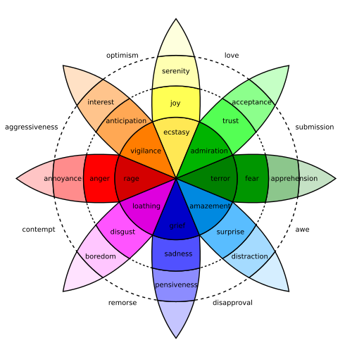

1. ML 방식 비교
2. LLM 방식 비교
3. ML, LLM 중 확실한거 고르기
4. encoder 완성

**PIPELINE**

>*input(x) -> Encoder(E) -> stimulus_vec(u) -> $\mathcal{N}$ -> H(emo_hist) -> H_encoder -> z(latent_emo_vec) -> style_mapper -> style(s) -> Decoder -> output*

* (x): 입력 텍스트
* (E): 인코더
* (u): 자극 벡터
* ($\mathcal{N}$): 감정 동역학 신경망
* (H): 감정 히스토리
* (z): 히스토리를 압축한 잠재 상태
* (s): 최종 응답 스타일/정서 상태 벡터
* (Decoder): 디코더 또는 출력 생성기
* (output): 최종 출력 텍스트       

&nbsp;

# 1. 입력 (x)

입력은 단순한 문장 하나일 수도 있고, 대화 문맥까지 포함한 사건일 수도 있다.   
예를 들면:

* “너 진짜 잘했다”
* “왜 그것도 못했어?”
* “괜찮아, 천천히 해”
* 직전 대화 히스토리 + 현재 발화

즉 입력은 그냥 문자열이 아니라,

$
x = (\text{text}, \text{speaker info}, \text{context}, \text{memory cues})
$

처럼 볼 수 있다.

여기서 중요한 건 입력 자체를 감정이라고 보지 않는다는 점이다.
입력은 **감정계를 흔드는 외부 사건**이다.
입력은 그저 하나의 자극을 주는 매개체에 불과하다.

&nbsp;

# 2. 인코더 (E)

인코더는 입력 텍스트를 읽어서 바로 감정을 내는 장치가 아니다.
정확히는:

> **입력을 분석해서 내부 시스템이 받을 자극 성분으로 바꾸는 장치**

이다.

즉

$
u = E(x)
$

여기서 $u$는 자극 벡터다.

인코더가 해야 하는 일은 이런 것이다.

* 말이 긍정적인지 부정적인지
* 위협적인지 안전한지
* 예측 가능했는지 뜻밖이었는지
* 사회적 수용인지 거절인지
* 목표를 방해하는지 돕는지
* 통제 가능한지 아닌지

를 추출해서 숫자로 바꾸는 것이다. 

&nbsp;

# 3. 자극 벡터 (u)

나는 이걸 10차원 정도로 두는 게 깔끔하다고 본다.   
$
u = [u_1, u_2, \dots, u_{10}]
$

축은 아래처럼 잡을 수 있다.

$
u = [v, a, th, sa, sr, nov, cert, ctrl, goal, err]
$

각 항의 의미는 이렇다.

* (v): valence
  좋음/나쁨

* (a): arousal
  자극 강도, 각성도

* (th): threat
  위협성, 공격성

* (sa): safety
  안전감, 보호감

* (sr): social relevance
  사회적 인정/거절 관련성

* (nov): novelty
  새로움, 예상 밖 정도

* (cert): certainty
  상황의 명확성

* (ctrl): controllability
  내가 다룰 수 있는 느낌

* (goal): goal congruence
  내 목표와 얼마나 맞는가

* (err): prediction error
  예상과 어긋난 정도

이렇게 두면 “기쁨”, “분노”, “불안” 같은 감정이 아니라 그저 자극을 팔레트의 물감 처럼 섞어서 다양한 자극을 표현할 수 있게 된다.

&nbsp;

# 4. NN: 감정 동역학 신경망 ($\mathcal{N}$)

네트워크는 크게 6층으로 두었다.

## 4-1. 전체 뉴런 구성

전체 상태 벡터를

$
h_t = [r_t, m_t, c_t, b_t, o_t, \ell_t]
$

로 둔다.

각 묶음은 다음 의미다.

* ($r_t$): 반응 뉴런층
* ($m_t$): 기억/잔향 뉴런층
* ($c_t$): 조절 뉴런층
* ($b_t$): body-like 뉴런층
* ($o_t$): 출력 직전 정서 뉴런층
* ($\ell_t$): 장기 기준점 뉴런층

자극은 각각의 층을 움직이며, 상태 벡터를 변화 시킨다

## 4-2. 반응 뉴런층 ($r_t$)

이 층은 입력 자극에 빠르게 반응하는 뉴런들이다.
“지금 무슨 일이 벌어졌는가”에 가장 먼저 반응하는 층이다.

$
r_t = [r^{joy}, r^{sad}, r^{anger}, r^{fear}, r^{disgust}, r^{surprise}, r^{trust}, r^{anticip}]
$

각 뉴런의 의미:

* ($r^{joy}$): 긍정 보상 반응
* ($r^{sad}$): 상실/슬픔 반응
* ($r^{anger}$): 분노/공격 반응
* ($r^{fear}$): 위협/회피 반응
* ($r^{disgust}$): 거부 반응
* ($r^{surprise}$): 놀람 반응
* ($r^{trust}$): 신뢰 반응
* ($r^{anticipate}$): 기대 반응

이건 플루칙 느낌의 기본 반응층이라고 보면 된다.

업데이트는 이렇게:

$
r_t = \sigma(W_{ur}u_t + W_{rr}r_{t-1} + W_{mr}m_{t-1} + b_r)
$

의 형태로 둔다.

즉 현재 자극과 이전 상태가 합쳐져서 즉각 반응이 나온다.

# 4-3. 기억/잔향 뉴런층 (m_t)

감정은 바로 꺼지지 않으니까,
잔향을 남기는 층이 필요하다.

$
m_t = $m^{pos}, m^{neg}, m^{threat}, m^{bond}, m^{shame}, m^{stress}$
$

각 뉴런 의미:

* (m^{pos}): 긍정 경험 잔향
* (m^{neg}): 부정 경험 잔향
* (m^{threat}): 위협 기억 축적
* (m^{bond}): 유대감/신뢰 기억
* (m^{shame}): 자기 위축/수치 기억
* (m^{stress}): 전반적 누적 스트레스

업데이트는 감쇠 포함으로 두는 게 좋다.

$
m_t = \lambda_m \odot m_{t-1} + (1-\lambda_m)\odot \phi(W_{rm}r_t + W_{um}u_t)
$

여기서 (\lambda_m)는 감쇠율이다.
즉 과거가 남아 있지만 서서히 줄어든다.

# 4-4. 조절 뉴런층 (c_t)

이 층은 감정을 직접 느끼는 층이 아니라,
감정을 **조절하고 제어하는 층**이다.

$
c_t = $c^{inhib}, c^{reapp}, c^{focus}, c^{stabil}, c^{impulse_gate}$
$

각 뉴런 의미:

* (c^{inhib}): 충동 억제
* (c^{reapp}): 재해석 능력
* (c^{focus}): 특정 자극에 주의 고정
* (c^{stabil}): 전체 안정화
* (c^{impulse_gate}): 감정이 바로 출력으로 새지 않게 막는 문

이 층이 없으면 시스템이 감정적으로 너무 쉽게 폭주한다.

업데이트는:

$
c_t = \sigma(W_{rc}r_t + W_{mc}m_t + W_{\ell c}\ell_{t-1} + b_c)
$

로 둘 수 있다.

# 4-5. body-like 뉴런층 (b_t)

완전히 생물학 복제는 아니지만,
감정에는 “몸상태 비슷한 내부 배경”이 필요하다.

$
b_t = $b^{energy}, b^{fatigue}, b^{tension}, b^{calm}, b^{drive}$
$

각 뉴런 의미:

* (b^{energy}): 현재 에너지 수준
* (b^{fatigue}): 피로도
* (b^{tension}): 긴장도
* (b^{calm}): 진정도
* (b^{drive}): 행동 추진력

예를 들어 같은 부정적 입력이어도

* 에너지가 높으면 분노 쪽으로
* 에너지가 낮으면 무기력/슬픔 쪽으로

갈 수 있다.

업데이트는:

$
b_t = \lambda_b \odot b_{t-1} + \phi(W_{rb}r_t + W_{mb}m_t + b_b)
$

# 4-6. 출력 직전 정서 뉴런층 (o_t)

이 층은 여러 내부 층을 종합해서
“지금 실제 정서적으로 어떤 형상이냐”를 나타내는 층이다.

$
o_t = $o^{val}, o^{aro}, o^{ten}, o^{safe}, o^{warm}, o^{avoid}, o^{approach}, o^{conf}$
$

각 뉴런 의미:

* (o^{val}): 최종 긍정/부정 경향
* (o^{aro}): 최종 각성도
* (o^{ten}): 최종 긴장도
* (o^{safe}): 안전감
* (o^{warm}): 친화성
* (o^{avoid}): 회피 성향
* (o^{approach}): 접근 성향
* (o^{conf}): 확신 정도

이 층은 실제 출력과 가장 가깝다.

$
o_t = \tanh(W_{ro}r_t + W_{mo}m_t + W_{co}c_t + W_{bo}b_t + b_o)
$

# 4-7. 장기 기준점 뉴런층 (\ell_t)

이건 되게 중요하다.
시스템이 매번 0에서 시작하지 않고, **기본 성향과 기준점**을 갖게 하는 층이다.

$
\ell_t = $\ell^{base_val}, \ell^{base_aro}, \ell^{resilience}, \ell^{sensitivity}, \ell^{social_openness}$
$

각 뉴런 의미:

* (\ell^{base_val}): 평소 긍정성 기준점
* (\ell^{base_aro}): 평소 각성 기준점
* (\ell^{resilience}): 충격 회복력
* (\ell^{sensitivity}): 자극 민감도
* (\ell^{social_openness}): 사회적 개방성

이건 천천히 바뀌거나 거의 고정값이어도 된다.

$
\ell_t = \lambda_\ell \odot \ell_{t-1} + (1-\lambda_\ell)\odot \phi(W_{m\ell}m_t + W_{o\ell}o_t)
$

단, (\lambda_\ell)는 아주 크게 둔다.
즉 이 층은 매우 천천히 움직인다.
