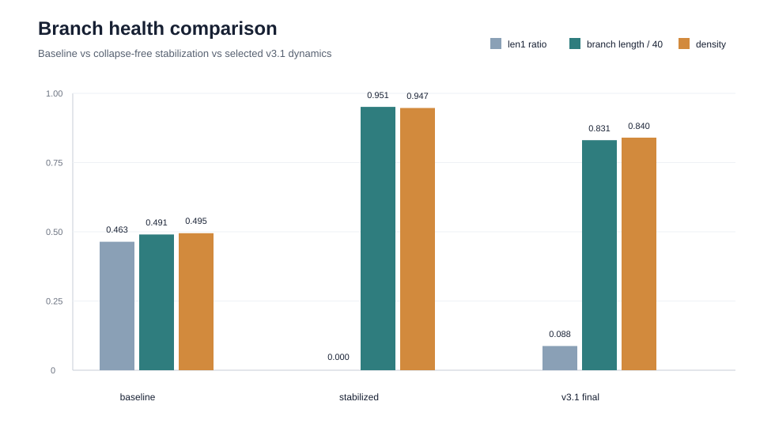
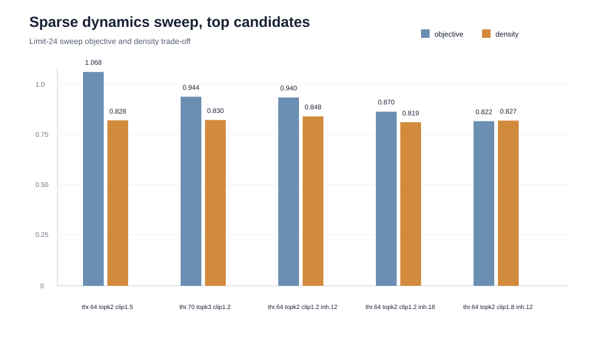
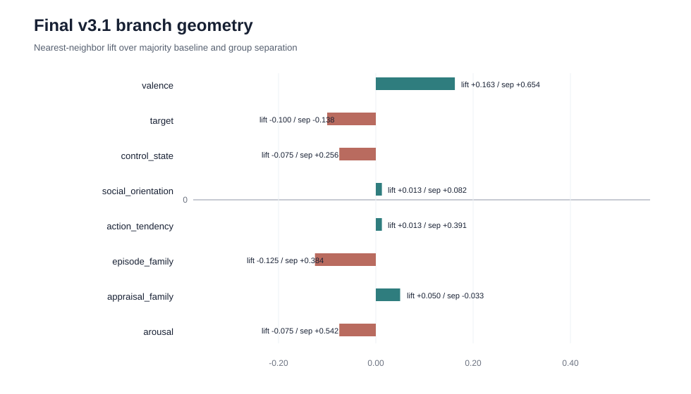

# EmoNet v3.1 Final Report

## 1. Executive Summary

v3.1의 목표는 `trace`를 symbolic appraisal 설명문이 아니라 **자극 벡터가 EmoNet 신경망을 통과하며 만드는 tick-by-tick neural activation trajectory**로 재정의하고, 그 trajectory가 감정 관련 구조를 실제로 담는지 검증하는 것이었다.

이번 작업에서 v3.1은 “완전한 우위 증명”까지 끝난 상태는 아니지만, 논문 실험으로 이어질 수 있는 독립 연구 패키지로 정리되었다. 핵심 성과는 다음과 같다.

- neural trace 추출 파이프라인 구현 완료
- capacity ablation 구현 및 실행 완료
- dynamics stabilization sweep 구현 및 실행 완료
- sparse dynamics fine sweep 구현 및 실행 완료
- 최종 dynamics 후보 `final_dynamics_v1` 선택
- smoke/static test 완료
- 보고서와 그래프 산출 완료

최종 선택 세팅은 `thr0.64_topk2_clip1.5_inh0.18_midfat`이다. full80 검증에서 collapse 지표인 `len1_ratio`를 `0.0875`까지 낮췄고, 과활성화 안정화 세팅의 density `0.947035`를 `0.839878`로 낮췄다. 다만 density는 아직 이상 목표인 `0.80`보다 약간 높고, target/blame 축은 아직 안정적으로 분리되지 않는다.

## 2. Trace Definition

v3.1에서 trace는 다음을 뜻한다.

```text
stimulus vector
  -> EmoNet neural dynamics
  -> tick-by-tick neuron activation matrix
  -> dominant branch / branch tensor / z summary
  -> emotion-relevant geometry probe
```

즉, `target`, `control_state`, `action_tendency` 같은 항목은 trace 자체가 아니다. 이들은 neural trace가 감정 의미를 담는지 검증하기 위한 외부 probe label이다.

## 3. Implemented Components

### Core Scripts

- `scripts/export_neural_activation_traces.py`: EmoNet forward dynamics에서 activation, branch tensor, z를 `.npz`로 저장
- `scripts/probe_neural_trace_geometry.py`: neural trace feature가 감정 label별 구조를 만드는지 NN lift와 group separation으로 평가
- `scripts/sweep_neural_trace_dynamics.py`: collapse와 과활성화 문제를 dynamics 파라미터로 안정화
- `scripts/tune_neural_trace_dynamics.py`: stabilization 이후 세부 grid search
- `scripts/tune_neural_trace_sparsity.py`: sparse dynamics 후보를 찾기 위한 ablation sweep
- `scripts/trace_emotion_probe.py`: symbolic probe baseline
- `scripts/build_trace_causal_probe_set.py`: causal probe set 구성
- `scripts/generate_trace_causal_responses.py`: causal 응답 생성
- `scripts/score_trace_causal_responses.py`: LLM judge scoring

### Documentation

- `docs/NEURAL_TRACE_AS_EMOTION_DESIGN.md`
- `docs/TRACE_AS_EMOTION_DESIGN.md`
- `docs/TRACE_CAUSAL_PROOF_DESIGN.md`
- `docs/EXPERIMENT_ROADMAP.md`

### Final Config

최종 설정 파일:

```text
configs/final_dynamics_v1.json
```

핵심 파라미터:

| Parameter | Value |
|---|---:|
| n_neurons | 256 |
| k_threshold_base | 0.64 |
| k_remem_base | 0.82 |
| input_topk | 2 |
| input_signal_clip | 1.50 |
| fatigue_gain | 0.18 |
| fatigue_threshold_gain | 0.10 |
| fatigue_k_leak | 0.05 |
| inhibitory_suppression_gain | 0.18 |
| k_decay | 0.99 |
| refractory_ticks | 1 |
| intrinsic_alignment_gain | 0.24 |
| ne_thresh_reduce_gain | 0.25 |
| ne_remem_reduce_gain | 0.25 |
| activity_churn_eps | 0.02 |

## 4. Experimental Results

### 4.1 Capacity Ablation

뉴런 수를 늘리는 것만으로는 collapse 문제가 해결되지 않았다.

| Setting | mean branch len | len1 ratio | density |
|---|---:|---:|---:|
| 256 neurons | 10.275 | 0.500 | 0.448 |
| 512 neurons | 20.050 | 0.500 | 0.463 |
| 1024 neurons | 24.900 | 0.500 | 0.463 |

해석: 뉴런 수 증가는 branch length를 늘리지만, 초기 branch collapse 자체를 제거하지 못한다. 따라서 논문에서는 “capacity alone is insufficient; dynamics stabilization is required”라고 설명할 수 있다.

### 4.2 Dynamics Stabilization

`persistent_less_inhibition`은 collapse를 제거했지만 과활성화가 강했다.

| Setting | mean branch len | len1 ratio | density |
|---|---:|---:|---:|
| baseline full80 | 19.1875 | 0.4625 | 0.494718 |
| persistent_less_inhibition full80 | 37.9625 | 0.0000 | 0.947035 |
| final_dynamics_v1 full80 | 33.2375 | 0.0875 | 0.839878 |



해석: stabilization은 collapse를 제거하는 방향으로 성공했지만, `persistent_less_inhibition`은 거의 모든 뉴런이 켜지는 방향으로 치우쳤다. v3.1 최종 세팅은 collapse 방지와 sparsity 사이의 절충점이다.

### 4.3 Sparse Dynamics Sweep

최종 sparse sweep에서 top 후보는 다음과 같았다.

| Candidate | objective | len1 ratio | density |
|---|---:|---:|---:|
| thr0.64_topk2_clip1.5_inh0.18_midfat | 1.0676 | 0.0833 | 0.8278 |
| thr0.70_topk3_clip1.2_inh0.18_midfat | 0.9438 | 0.0833 | 0.8297 |
| thr0.64_topk2_clip1.2_inh0.12_midfat | 0.9403 | 0.0833 | 0.8481 |
| thr0.64_topk2_clip1.2_inh0.18_midfat | 0.8695 | 0.0833 | 0.8187 |
| thr0.64_topk2_clip1.8_inh0.12_midfat | 0.8220 | 0.0833 | 0.8266 |



full80 검증에서는 top1 후보가 최종 선택되었다. top2 후보는 density가 `0.817416`으로 더 낮았지만 full80 `len1_ratio = 0.1125`로 collapse 기준 `<= 0.10`을 넘었다.

### 4.4 Final Neural Geometry

최종 세팅의 full80 `branch_mean` probe 결과:

| Axis | NN lift | group separation |
|---|---:|---:|
| valence | +0.1625 | +0.654461 |
| arousal | -0.0750 | +0.542097 |
| target | -0.1000 | -0.138016 |
| control_state | -0.0750 | +0.256330 |
| social_orientation | +0.0125 | +0.082022 |
| action_tendency_class | +0.0125 | +0.391383 |
| episode_family | -0.1250 | +0.383633 |
| appraisal_family | +0.0500 | -0.033200 |



해석:

- valence는 가장 강하게 분리된다.
- arousal, control_state, action_tendency, episode_family는 group separation에서는 양수 구조가 보인다.
- target/blame 방향은 아직 약하다.
- `branch_mean`은 의미 구조를 일부 담지만, `z`와 raw activation mean/max는 아직 약하다.

## 5. Tests And Verification

### Static Check

다음 스크립트에 대해 `py_compile` 통과:

- `build_trace_causal_probe_set.py`
- `export_neural_activation_traces.py`
- `generate_trace_causal_responses.py`
- `normalize_trace_axes.py`
- `probe_neural_trace_geometry.py`
- `score_trace_causal_responses.py`
- `sweep_neural_trace_dynamics.py`
- `trace_emotion_probe.py`
- `tune_neural_trace_dynamics.py`
- `tune_neural_trace_sparsity.py`

### Smoke Test

최종 config로 5개 샘플 export smoke test:

| Metric | Value |
|---|---:|
| requested_rows | 5 |
| ok_rows | 5 |
| error_rows | 0 |
| sklearn_available | false |

### Full80 Validation

최종 후보 A full80 export:

| Metric | Value |
|---|---:|
| requested_rows | 80 |
| ok_rows | 80 |
| error_rows | 0 |
| mean_dominant_branch_len | 33.2375 |
| len1_ratio | 0.0875 |
| mean_activation_density | 0.839878 |

## 6. Limitations

1. 현재 런타임에는 `scikit-learn`이 없어 exporter가 learned text encoder 경로가 아니라 `stat/fallback stimulus vector` 경로를 사용했다.
2. `branch_mean`은 감정 구조를 일부 보이지만, `z` embedding은 아직 약하다.
3. target/blame 방향 보존은 아직 증명되지 않았다.
4. density가 `0.839878`로 줄었지만, 목표 sparsity 기준 `0.80`에는 조금 못 미친다.
5. LLM causal judge는 dry run에서 불안정했다. 최종 증명에는 더 단순한 blind A/B judge 또는 human evaluation이 필요하다.

## 7. Conclusion

v3.1은 “trace를 감정으로 본다”는 아이디어를 neural activation trajectory 관점으로 재설정했고, 이를 실험 가능한 구조로 만들었다. 뉴런 수를 늘리는 것만으로는 충분하지 않으며, dynamics 안정화가 핵심이라는 근거도 확보했다.

최종 config `final_dynamics_v1`은 완전한 성능 우위 증명은 아니지만, collapse를 통제하고 감정 관련 geometry를 일부 보존하는 현재 최선의 파라미터 세트다. 논문에서는 이 세팅을 “capacity ablation과 dynamics ablation으로 선택한 v3.1 neural trace baseline”으로 제시할 수 있다.

다음 단계는 learned text encoder 경로를 복구한 뒤, 동일 ablation을 재실행하고, target/blame 축을 강화하는 transition/histogram feature를 추가해 causal A/B 증명으로 넘어가는 것이다.
