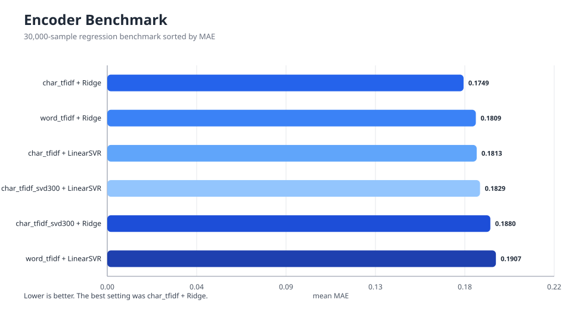
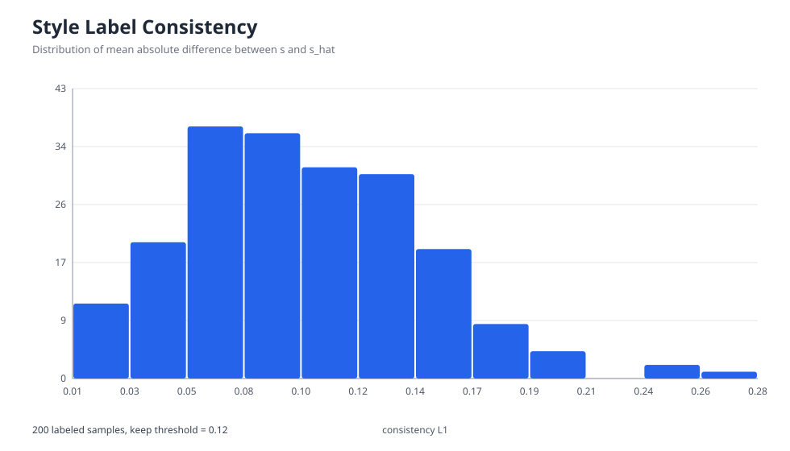
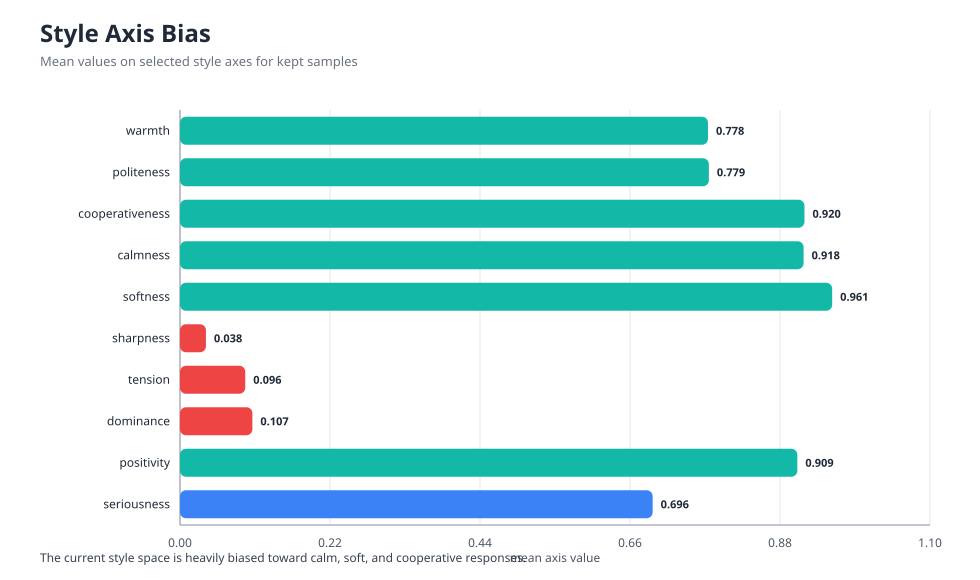
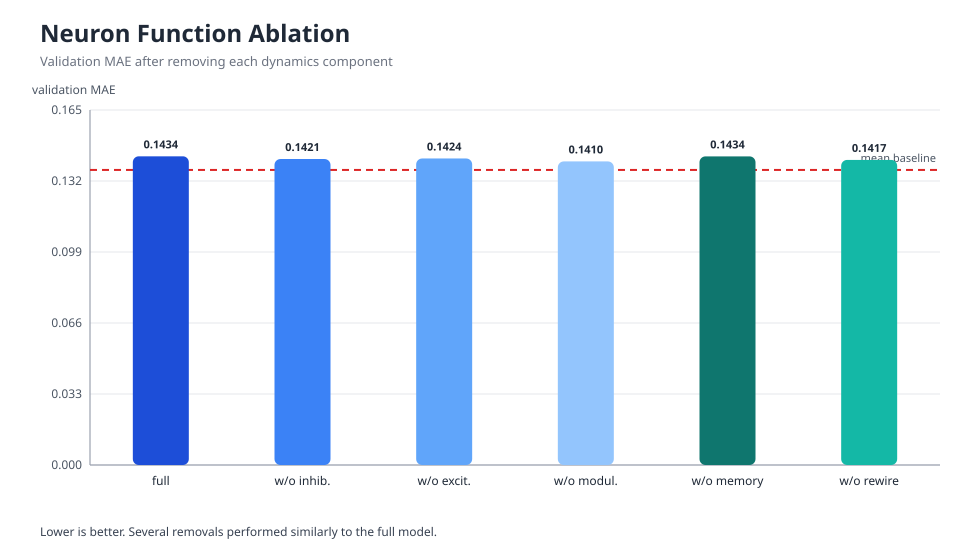
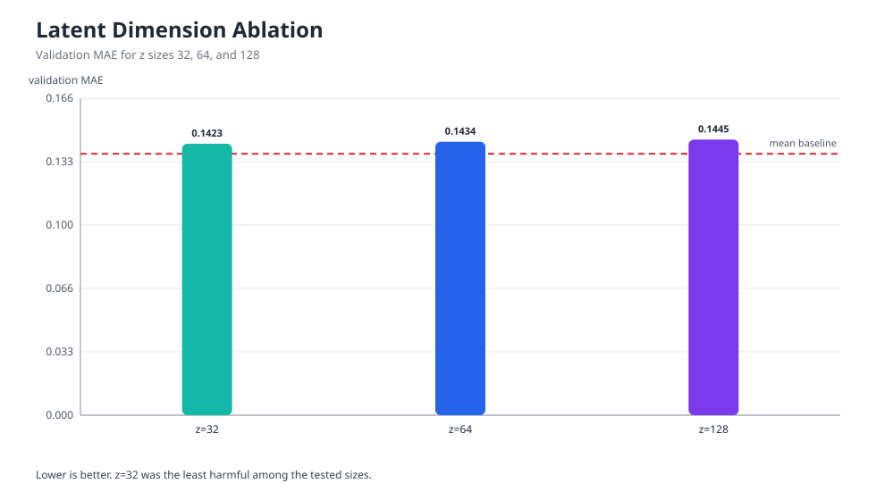
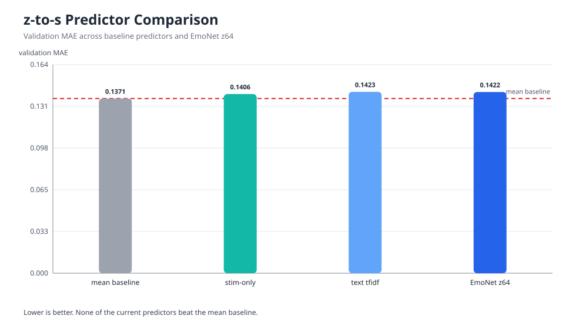
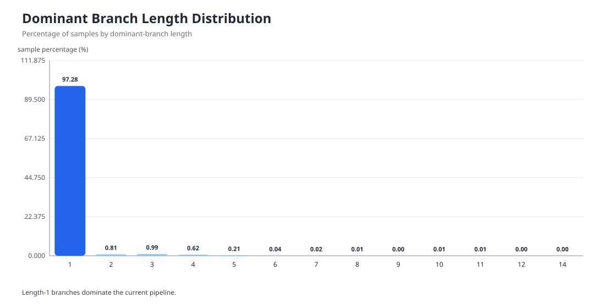
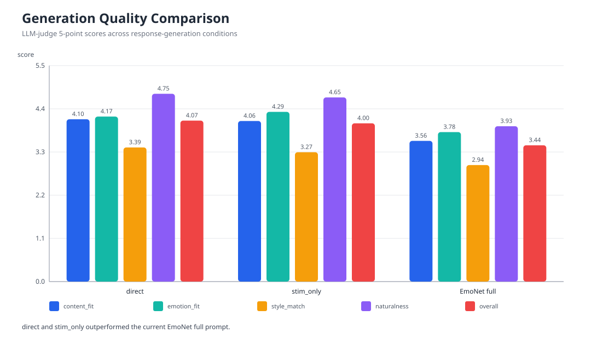

# EmoNet: 감정 동역학 중간표현과 스타일 제어를 분리한 한국어 응답 생성 프레임워크

## 초록
대규모 언어모델 기반 대화 시스템은 의미 보존과 문장 자연성 측면에서 빠르게 발전해 왔으나, 감정 처리의 대부분은 여전히 감정 라벨 분류, 프롬프트 속성 주입, 또는 표면적 말투 제어 수준에 머무르는 경우가 많다. 이러한 접근은 최종 응답의 품질을 일정 부분 향상시킬 수 있으나, 감정 상태가 내부에서 어떠한 경로를 거쳐 형성되고 조절되는지 설명하기 어렵고, 감정 제어 또한 결과 문장 수준의 후처리에 가까워지는 한계를 갖는다. 본 연구는 이러한 문제를 해결하기 위해 입력 자극, 감정 동역학, 잠재 정서 표현, 스타일 표면화를 분리한 한국어 응답 생성 프레임워크 `EmoNet`을 제안한다. 제안 구조는 입력 텍스트 `x`를 4차원 정서 자극 벡터로 투영한 뒤, 군집 구조를 가진 감정 동역학 신경망 `\mathcal{N}(\mathcal{C})` 안에서 자극의 확산과 억제, 기억, 재배선을 수행하고, 그 과정에서 형성된 지배 경로 기록 `H_{traj}`를 잠재 감정 벡터 `z`로 압축한다. 이후 `z`로부터 32차원 스타일 벡터 `s`를 회귀하고, 이를 프롬프트 제어 신호로 변환하여 최종 LLM 응답 `y`를 생성한다. 현재 구현 산출물 기준 `z` 데이터는 51,628개 샘플과 60개 감정 라벨을 포함하며, 스타일 라벨링용 균형 subset 500개 중 200개 샘플에 대해 로컬 LLM 기반 약지도 평가를 수행한 결과 190개 샘플이 일관성 기준을 통과하였다. 자극 인코더는 30,000개 벤치마크 샘플에서 `char_tfidf + Ridge` 조합이 평균 MAE 0.1749, 평균 RMSE 0.2139, 평균 `R^2` 0.4278, 평균 Spearman 0.6388로 가장 안정적인 성능을 보였다. 반면 `z -> s` 회귀는 현재 기준 mean baseline보다 낮은 MAE를 달성하지 못하였고, end-to-end 생성 평가에서도 직접 프롬프트 방식의 전체 평균 점수 4.0949가 `EmoNet full` 조건의 3.5296보다 높게 나타났다. 이러한 결과는 현 단계의 EmoNet이 최종 응답 성능을 입증한 완성형 모델이라기보다, 감정 제어 문제를 자극, 경로, 잠재 상태, 스타일의 계층으로 분해하여 병목 지점을 구조적으로 진단할 수 있게 하는 연구 프레임워크임을 시사한다.

주요어: 감정 대화 생성, controllable generation, 스타일 제어, 그래프 동역학, 잠재표현, 한국어 LLM

## 1. 서론
감정 응답 생성은 단순한 조건부 텍스트 생성 문제와 구별된다. 동일한 의미를 전달하더라도, 화자의 정서 상태와 응답자의 태도에 따라 문장의 거리감, 온도, 직설성, 안정감, 위로의 강도는 크게 달라진다. 따라서 감정 대화 시스템은 무엇을 말할 것인가뿐 아니라, 어떠한 감정 상태를 거쳐 어떤 표현 양식으로 말할 것인가를 함께 다루어야 한다.

그러나 기존의 대규모 언어모델 기반 감정 응답 시스템은 대체로 두 가지 전략에 의존한다. 첫째는 입력 텍스트를 직접 응답으로 매핑하는 end-to-end 생성 방식이다. 둘째는 감정 라벨, 속성 토큰, 혹은 prompt attribute를 부가 조건으로 주입하는 제어 방식이다. 이들 접근은 실용적이며 구현 비용이 낮다는 장점이 있지만, 감정이 내부에서 어떻게 형성되고 조절되었는지를 설명하기 어렵고, 감정 상태와 표면 스타일이 하나의 생성기 내부에 뒤섞여 나타난다는 한계를 갖는다. 결과적으로 특정 응답이 왜 생성되었는지, 어느 단계에서 감정 편향이 발생했는지, 또는 감정 상태와 스타일을 독립적으로 조절할 수 있는지를 명확히 파악하기 어렵다.

본 연구는 이러한 문제를 해결하기 위해 감정 응답 생성을 자극 인코딩, 감정 동역학, 지배 경로 요약, 잠재 감정 압축, 스타일 회귀, LLM 표면화의 다단계 구조로 분해한 `EmoNet`을 제안한다. 제안 구조의 목적은 단순히 파이프라인의 단계를 늘리는 데 있지 않다. 핵심은 감정 자극의 입력, 내부 상태의 전개, 최종 말투의 표면화를 서로 다른 계층으로 분리함으로써, 감정 제어를 해석 가능한 구조 문제로 재구성하는 데 있다.

본 연구의 기여는 다음과 같이 요약된다.

1. 한국어 감정 응답 생성을 감정 동역학, 잠재표현, 스타일 제어, 표면화 단계로 분해한 모듈형 프레임워크를 제안한다.
2. 4차원 자극 벡터와 그래프 기반 감정 동역학을 통해 감정 상태의 흐름을 branch 기반 중간표현으로 기록하는 절차를 구현한다.
3. 로컬 LLM을 활용하여 `(z, s)` 약지도 데이터셋을 구축하고, 현재 구조의 병목이 branch collapse, 스타일 공간 편향, `z -> s` 회귀 한계에 있음을 실험적으로 분석한다.

## 2. 선행 연구

### 2.1 공감형 감정 대화 생성 연구
공감형 대화 생성 연구는 사용자의 감정을 인식하고 이에 적절한 반응을 생성하는 방향으로 발전해 왔다. MoEL은 감정 분포를 바탕으로 복수의 listener를 mixture 방식으로 결합해 공감 응답을 생성하였고, EmpDG는 대화 수준과 토큰 수준의 감정을 함께 반영함으로써 보다 세밀한 공감 표현을 시도하였다. SEEK는 감정을 정적인 단일 변수로 취급하는 기존 방식의 한계를 지적하며 대화 내 emotion flow를 더 민감하게 포착하려 하였고, NEC는 세밀한 감정 인식 오류가 응답 생성 과정에서 연쇄 오류를 유발할 수 있음을 보이며 비감정 중심 공감 생성 구조를 제안하였다. 이 계열 연구는 공감적 품질 향상에 중요한 기여를 했으나, 감정을 주로 라벨, 임베딩, 또는 외부 condition으로 다루었다는 점에서 감정 상태의 내부 형성 경로를 명시적으로 드러내지는 못했다.

### 2.2 감정 흐름과 그래프 기반 정서 모델링
감정은 대화 맥락 안에서 시간적으로 누적되고 전이되므로, 최근 연구는 감정의 흐름을 구조적으로 다루려는 시도를 보여 왔다. DialogueGCN은 대화 참여자 간 의존관계를 그래프로 모델링하여 기존 순환 신경망의 문맥 전파 한계를 보완하였다. SEEK 역시 감정을 정적 변수로 두는 대신 발화 간 변화하는 emotion flow를 세밀하게 추적해야 한다고 보았다. 그러나 이들 연구의 초점은 주로 감정 인식 또는 감정 예측 정확도 향상에 있으며, 감정 상태를 후속 응답 스타일 제어로 연결하는 중간표현 설계까지는 확장되지 않았다. EmoNet은 이 지점에서 그래프 구조를 분류기가 아니라 응답 생성 직전의 감정 궤적 기록 장치로 사용한다는 점에서 차별화된다.

### 2.3 제어 가능한 텍스트 생성 연구
제어 가능한 생성 연구는 특정 속성이나 스타일을 만족하는 텍스트를 만들기 위해 control code, attribute classifier, decoding-time guidance 등 다양한 방법을 제안해 왔다. CTRL은 사전 정의된 control code로 생성 방향을 제어하였고, PPLM은 attribute classifier gradient를 활용해 사전학습 언어모델의 hidden state를 조정하였다. FUDGE는 partial sequence 기반 미래 판별기를 사용하여 디코딩 시점에서 원하는 속성을 만족하도록 확률을 보정하였다. 이러한 연구는 생성기의 속성 정합성을 높이는 데 효과적이지만, 속성의 원인이 되는 내부 감정 상태의 형성과 변화 자체를 설명하지는 않는다. EmoNet은 제어의 초점을 출력 디코딩이 아니라 감정 동역학 내부 단계로 이동시킨다는 점에서 접근 방향이 다르다.

### 2.4 잠재공간 기반 스타일 분리 연구
잠재공간에서 내용과 스타일을 분리하려는 연구도 활발하게 이루어져 왔다. Neural Stylistic Response Generation with Disentangled Latent Variables는 latent space에서 content와 style을 분리해 스타일 강도와 내용 적합성의 균형을 맞추고자 하였고, MIRACLE은 다중 인격 속성을 잠재공간에서 조합 가능하게 설계해 세밀한 persona 제어를 강화하였다. CTSM은 공감 응답에서 trait emotion과 state emotion을 함께 다루며 정적 성향과 동적 상태의 구분 필요성을 강조하였다. EmoNet은 이러한 문제의식을 계승하되, 잠재벡터 `z` 이전에 지배 경로와 branch history를 남김으로써 감정 상태가 어떤 내부 경로를 거쳐 `z`와 `s`로 압축되는지를 보다 명시적으로 보존한다.

### 2.5 본 연구의 위치
기존 연구는 공감 생성, 감정 흐름 추적, 제어 가능한 생성, 잠재 스타일 분리 측면에서 각각 중요한 진전을 이루었다. 그러나 감정 자극이 내부 상태의 전개를 거쳐 응답 스타일로 표면화되는 전 과정을 하나의 해석 가능한 연쇄 구조로 제시한 연구는 드물다. EmoNet은 자극 벡터, 군집형 감정 동역학, 지배 branch, 잠재 감정 표현 `z`, 스타일 벡터 `s`를 순차적으로 연결함으로써 감정을 단순 condition이 아니라 추적 가능한 내부 상태 변화로 다룬다는 점에서 기존 연구와 구별된다.

## 3. 연구 문제 설정
기존의 감정 조건부 언어모델은 감정을 분류 가능한 범주, 프롬프트 속성, 또는 제어 토큰으로 표현하는 경우가 많다. 그러나 실제 감정 반응은 단일 라벨의 선택이 아니라, 외부 자극이 내부 상태를 변화시키고 그 변화가 다시 표현 양식에 영향을 미치는 연속적 과정에 더 가깝다. 따라서 감정을 단순히 인식하거나 분류하는 것만으로는 모델이 감정을 어떻게 이해하고 조절하여 표현하는지 충분히 설명하기 어렵다.

이 문제의식을 바탕으로 본 연구는 다음 세 가지 연구 질문을 설정한다.

1. 입력 텍스트를 자극, 감정 동역학, 잠재 상태, 스타일 표현으로 분리하는 구조가 실제로 구현 가능한가.
2. 이러한 분리형 구조가 기존의 직접 프롬프트 방식보다 감정 제어의 해석 가능성을 높일 수 있는가.
3. 최종 성능 향상이 즉시 관찰되지 않더라도, 어떤 단계가 현재 시스템의 병목인지 더 명확하게 진단할 수 있는가.

이와 함께 본 연구는 다음과 같은 가설을 전제한다. 첫째, 감정은 하나의 라벨보다 동역학적 경로로 표현될 때 더 풍부하게 기술될 수 있다. 둘째, 잠재 감정 표현과 표면 스타일을 분리하면 감정 제어의 실패 원인을 더 세분화해 분석할 수 있다. 셋째, 해석 가능한 중간표현을 도입하면 성능 우위와 별개로 구조적 진단 가능성이 향상된다.

## 4. 연구 목표
본 연구의 목표는 연구 문제와 직접 대응되도록 다음과 같이 설정한다.

1. 입력 자극으로부터 내부 감정 상태의 전개를 생성하는 neuro-inspired 감정 동역학 신경망을 설계한다.
2. 설계된 신경망이 자극을 잠재 감정 표현 `z`와 스타일 표현 `s`로 안정적으로 가공할 수 있는지 실험적으로 검증한다.
3. 최종 응답이 감정 적합성, 스타일 반영, 자연성 측면에서 기존 방식과 어떻게 다른지 비교 평가한다.
4. 응답 지연, 구조 단순화 가능성, 프롬프트 호환성, 유지보수 난도를 기준으로 실제 서비스 적용 가능성을 점검할 수 있는 평가 기준을 제시한다.

## 5. 시스템 구조와 설계

### 5.1 전체 구조
본 연구는 다음과 같은 연쇄 구조를 채택한다.

```math
x \rightarrow E_{aff}(x) \rightarrow v_{stim} \rightarrow \mathcal{N}_{cad}(\mathcal{C}) \rightarrow H_{traj} \rightarrow E_H \rightarrow z \rightarrow R_{tone}(z) \rightarrow s \rightarrow G_{prompt} \rightarrow LLM \rightarrow y
```

이를 개념적으로 정리하면 입력 텍스트가 감정 자극 벡터로 변환되고, 이 자극이 군집형 감정 동역학 코어 안에서 경로 형태로 전개된 뒤, 지배 경로와 요약 상태가 잠재벡터와 스타일벡터로 압축되고, 최종적으로 LLM이 이를 자연어 응답으로 표면화하는 구조라고 볼 수 있다.

[그림 1 삽입 위치: 전체 파이프라인 구조도. 입력 텍스트, stimulus vector, 감정 동역학 코어, dominant branch, z, s, prompt, LLM, 최종 응답을 한 흐름으로 보여주는 개요도.]

### 5.2 Affective Stimulus Encoder
`E_aff`의 역할은 입력 텍스트를 단순 의미 임베딩이 아니라 감정 반응을 유발할 수 있는 자극 표현으로 바꾸는 것이다. EmoNet의 현재 구현은 `dopamine`, `serotonin`, `norepinephrine`, `melatonin`의 네 축으로 자극을 구성한다. 각각은 보상과 접근 성향, 안정과 평형, 긴장과 각성, 피로와 둔화 성향을 대리적으로 나타내는 proxy signal이다. 이 단계의 핵심은 텍스트를 바로 응답 생성기로 넘기지 않고, 먼저 "무엇이 감정적 자극으로 작용하는가"를 저차원 연속 공간으로 추상화한다는 점이다. 이러한 설계는 후속 단계에서 입력이 어떤 정서적 방향으로 시스템을 이동시켰는지를 보다 명시적으로 추적할 수 있게 한다.

### 5.3 Clustered Neuro-Affective Dynamics Core
감정 동역학 코어 `\mathcal{N}_{cad}(\mathcal{C})`는 본 연구의 핵심 구성요소이다. 현재 구현은 총 256개 뉴런으로 구성되며, inhibitory 115개, excitatory 115개, modulatory 26개를 포함한다. 각 tick에서 뉴런은 입력 신호, 현재 자극, 기억 상태, 전역 threshold shift를 반영해 활성도 `K`를 갱신하고, 활성 노드는 연결된 이웃으로 신호를 전파한다. 또한 memory mixing, threshold 조정, dropout, rewiring이 함께 수행된다. 이러한 구조를 채택한 이유는 감정을 정적인 라벨이 아니라, 네트워크 내부에서 확산되고 억제되며 유지되는 동적 상태로 모델링하기 위해서다.

[그림 2 삽입 위치: 감정 동역학 신경망 구조도. excitatory, inhibitory, modulatory 뉴런을 색으로 구분하고 cluster 경계, intra-cluster edge, inter-cluster edge, rewiring 지점을 함께 표시.]

[그림 3 삽입 위치: 단일 뉴런 업데이트 도식. 입력 자극, threshold, memory, 활성도 K, 억제/흥분 효과, output firing 순서를 한 노드 기준으로 보여주는 계산 흐름도.]

### 5.4 Trajectory Memory와 Dominant Branch
감정 동역학이 진행되면 여러 활성 경로가 동시에 형성되지만, 최종 응답에 더 직접적으로 기여하는 것은 상대적으로 더 강하고 오래 유지된 경로이다. 본 연구에서는 이를 dominant branch라고 정의한다. `H_{traj}`는 각 tick에서 어떤 노드가 활성화되었고 어떤 edge가 발화했는지를 기록하는 trajectory memory이며, dominant branch는 이 기록에서 살아남은 경로를 요약한 결과이다. 이 장치를 둔 이유는 평균 활성도만으로는 감정 전개의 구조를 설명하기 어렵기 때문이다. 즉, 어떤 뉴런 집합이 먼저 반응했는지, 어떤 경로가 억제되었는지, 어떤 경로가 최종적으로 생존했는지를 보존함으로써 감정 상태를 경로 기반으로 해석할 수 있다.

[그림 4 삽입 위치: branch 형성과 dominant branch 선택 도식. tick별 활성 경로의 분기, pruning, 생존 경로, 최종 dominant branch 선택 과정을 시간축으로 표현.]

### 5.5 Latent Affect Distiller와 Tone Realizer
`E_H`는 branch history를 잠재 감정 표현 `z`로 압축하는 모듈이다. 내부 동역학의 전체 로그를 그대로 LLM에 전달하면 구조가 지나치게 무거워지고 해석 또한 어려워지므로, EmoNet은 dominant branch의 step별 특징을 통계적으로 요약하여 `z`를 생성한다. 현재 구현은 학습형 transformer 대신 통계 요약 기반 인코더를 사용하며, branch step의 평균, 표준편차, 최소값, 최대값, 시작값, 종료값, 변화량, 기울기를 집계해 `z`를 구성한다.

`R_tone`은 잠재 감정 `z`를 바로 문장으로 변환하지 않고, 먼저 스타일 벡터 `s`로 회귀하는 모듈이다. 이 분리는 감정 상태와 표면 말투가 관련은 있으나 동일하지 않다는 가정에 기반한다. 예를 들어 높은 긴장은 공격적 문장으로 드러날 수도 있고, 억제된 격식체로 표현될 수도 있다. 따라서 EmoNet은 감정 상태를 설명하는 `z`와 언어 표면의 톤을 설명하는 `s`를 구분하여 다룬다.

[그림 5 삽입 위치: `H_{traj} -> z -> s` 압축 과정. branch history가 잠재벡터 z로, 다시 스타일벡터 s로 변환되는 representation flow를 도식화.]

### 5.6 Prompt Surface Composer와 LLM
마지막 단계에서 `G_prompt`는 스타일 벡터 `s`를 자연어 지시와 태그 요약으로 변환하고, LLM은 이를 입력받아 최종 응답 `y`를 생성한다. 이때 LLM은 감정 상태를 처음부터 계산하는 주체라기보다, EmoNet이 계산한 감정 상태와 스타일을 언어로 표면화하는 장치로 기능한다. 이러한 분업 구조는 감정 상태의 형성과 표면 표현을 명확히 분리하며, 어느 단계에서 실패가 발생했는지를 보다 세밀하게 추적할 수 있게 한다.

### 5.7 설계 선택의 근거
제안 구조는 단순히 모듈 수를 늘리기 위해 설계된 것이 아니다. 직접 프롬프트 방식은 자연성과 효율 측면에서 유리하지만 감정 처리 과정이 블랙박스로 남는다. 반면 감정 라벨 기반 prompting은 제한적 제어는 가능하나 내부 상태 전개를 설명하지 못한다. EmoNet은 자극, 경로, 잠재표현, 스타일, 표면화를 분리함으로써 성능이 즉시 최고가 아니더라도 병목의 위치를 추적할 수 있는 분석 구조를 제공한다. 실제 실험에서도 dominant branch 붕괴, 스타일 공간 편향, `z -> s` 회귀 한계, 프롬프트 평균화 문제를 분리하여 해석할 수 있었다.

## 6. 연구 방법

### 6.1 데이터 구성
현재 실험에서 사용한 `z` 데이터는 총 51,628개 샘플로 구성되며, 감정 라벨은 60종이다. 각 샘플에는 정규화된 대화 텍스트, 4차원 자극값, dominant branch 길이, 64차원 `z`가 포함된다. 스타일 라벨링 비용을 줄이기 위해 전체 데이터에서 500개의 균형 subset을 별도로 추출하였고, 이 중 200개 샘플에 대해 로컬 LLM 기반 스타일 라벨링을 수행하였다.

### 6.2 자극 인코더 벤치마크
자극 인코더는 `encoder-ML testing` 벤치마크를 통해 비교하였다. 후보 조합은 char-level TF-IDF, word-level TF-IDF, SVD 축소 버전과 Ridge, LinearSVR, HistGBDT, ElasticNet 등을 포함하였다. 평가 기준은 평균 MAE, 평균 RMSE, 평균 `R^2`, 평균 Spearman 상관계수이며, 30,000개 샘플 기준으로 비교를 수행하였다. 최종적으로 `char_tfidf + Ridge`가 가장 낮은 오차와 가장 높은 상관을 보여 기본 자극 인코더로 채택되었다.

### 6.3 스타일 라벨링 절차
스타일 라벨링은 수작업 주석 대신 로컬 LLM을 활용한 약지도 방식으로 수행하였다. 먼저 입력 텍스트로부터 응답 초안을 생성한 뒤, 동일 모델이 해당 응답을 다시 읽고 32개 스타일 축에 대한 값을 평가하였다. 이 과정에서 목표 스타일 벡터 `s`와 응답 재평가 벡터 `s_hat`를 함께 저장하였으며, `mean(abs(s - s_hat))`를 consistency L1으로 정의하였다. 현재 라벨링 결과에서는 200개 샘플 중 190개 샘플이 keep threshold를 통과하였다.

### 6.4 Ablation 설정
시스템 구조의 기여를 검증하기 위해 두 종류의 ablation을 수행하였다. 첫째, neuron function ablation에서는 inhibitory, excitatory, modulatory, memory, rewiring 기능을 각각 제거하거나 약화하였다. 둘째, latent dimension ablation에서는 `z`의 차원을 32, 64, 128로 변화시키며 `z -> s` 회귀 성능을 비교하였다. 모든 비교는 동일한 keep 샘플 190개를 사용해 5개 seed hold-out split으로 평가하였다.

### 6.5 Baseline 생성 조건과 평가 지표
응답 생성 baseline은 세 가지 조건으로 구성하였다. `direct`는 입력 텍스트만을 사용한 직접 프롬프트 방식이며, `stim_only`는 4차원 자극 벡터만 추가한 단순 제어 방식이다. `emonet_full`은 `s_pred`, style tags, style summary, expression cues를 모두 사용하는 전체 구조이다. 평가 지표는 content fit, emotional appropriateness, style match, naturalness, overall quality의 다섯 항목이며, 현재 단계에서는 LLM judge 기반 5점 척도 자동 채점을 사용하였다.

### 6.6 구현 환경
전체 시스템은 Python 기반 CLI 파이프라인으로 구현되었다. 주요 명령은 `export-z`, `build-llm-subset`, `label-local`, `fit-zs-regressor`, `predict-s`, `generate-response`, `e2e-check`로 구성된다. 스타일 라벨링과 최종 응답 생성은 Ollama 호환 OpenAI-compatible 엔드포인트를 통해 수행되었으며, 저장된 성공 로그 기준 모델 이름은 `gpt-oss:20b`이다.

### 6.7 연구의 현재 범위
본 연구의 현재 단계에서는 사람 평가와 실제 서비스 latency 측정을 포함하지 않았다. 따라서 결과 해석은 완성형 생성 품질의 최종 입증이라기보다, 구조적 진단과 병목 분석에 중점을 두어야 한다.

## 7. 연구 결과 및 논의

### 7.1 자극 인코더의 성능
자극 인코더 벤치마크 결과, `char_tfidf + Ridge` 조합이 평균 MAE 0.1749, 평균 RMSE 0.2139, 평균 `R^2` 0.4278, 평균 Spearman 0.6388로 가장 안정적인 성능을 나타냈다. 이는 입력 텍스트를 후속 감정 동역학으로 넘기기 위한 기초 자극 표현이 최소한의 분리 능력을 확보하고 있음을 의미한다. 따라서 현재 구조에서 관찰되는 한계를 Encoder 이전 단계의 실패로 보기보다는, 이후 branch 형성, 잠재표현, 스타일 회귀 단계의 문제로 해석하는 것이 더 타당하다.



그림 6. 자극 인코더 벤치마크 상위 6개 조합의 평균 MAE 비교. 낮을수록 좋으며, `char_tfidf + Ridge`가 가장 낮은 오차를 기록하였다.

### 7.2 스타일 라벨링의 일관성과 분포 편향
스타일 라벨링 결과, 200개 샘플 중 190개가 keep 기준을 통과하여 keep rate는 95.0%로 나타났다. 평균 consistency L1은 0.0998, 중앙값은 0.0938이었다. 이는 로컬 LLM 기반 약지도 절차가 적어도 자기일관성 측면에서는 작동하고 있음을 보여준다. 그러나 분포를 자세히 살펴보면 cooperativeness 0.9197, calmness 0.9184, softness 0.9605, positivity 0.9092가 매우 높고, sharpness 0.0382, tension 0.0961, dominance 0.1066이 매우 낮다. 다시 말해 현재 스타일 공간과 라벨링 프롬프트는 전반적으로 부드럽고 차분하며 협조적인 응답을 강하게 선호하고 있다.



그림 7. `s`와 `s_hat` 사이 consistency L1 분포. 일관성 자체는 비교적 높지만, 이는 스타일 공간의 객관적 타당성을 직접 보장하지는 않는다.



그림 8. keep 샘플 기준 주요 스타일 축 평균값. calmness, softness, cooperativeness가 매우 높고 sharpness, tension, dominance가 매우 낮아 현재 스타일 공간의 온건화 편향이 확인된다.

이 결과는 이후의 `z -> s` 회귀와 최종 생성 모두에 평균화 압력을 가한다. 즉, 스타일 라벨링의 일관성은 확보되었으나, 스타일 공간 자체가 충분히 넓고 균형 잡힌 분포를 제공하지 못하고 있다.

### 7.3 뉴런 기능과 잠재 차원 ablation
뉴런 기능 제거 실험에서는 full model의 평균 validation MAE가 0.1434였고, `without_modulatory`는 0.1410, `without_rewiring`은 0.1417, `without_inhibitory`는 0.1421, `without_memory`는 0.1434 수준이었다. 모든 조건이 mean baseline 0.1371보다 낮지는 않았으며, 일부 제거 조건이 full model과 비슷하거나 오히려 약간 낮은 오차를 나타냈다. 이는 현재 branch 요약과 스타일 회귀가 복잡한 감정 동역학의 장점을 충분히 활용하지 못하고 있음을 시사한다.



그림 9. 뉴런 기능 ablation에 따른 validation MAE. 모든 조건이 mean baseline보다 우세하지 않으며, 일부 제거 조건이 full model과 유사하거나 약간 낮은 오차를 보인다.

잠재 차원 비교에서는 `z=32`가 0.1423, `z=64`가 0.1434, `z=128`이 0.1445를 기록하였다. 즉, 현재 구조에서는 큰 잠재공간이 더 좋은 표현력을 제공하기보다 오히려 잡음과 불안정을 증가시키는 방향으로 작동하였다. 따라서 현 단계에서 더 큰 `z`를 채택하는 것보다, branch 표현력 자체와 스타일 타깃의 품질을 개선하는 것이 우선 과제라고 해석할 수 있다.



그림 10. `z` 차원 변화에 따른 validation MAE. 현재 구현에서는 차원이 커질수록 예측 오차가 증가하는 경향을 보였다.

### 7.4 `z -> s` 회귀 성능
`z -> s` 회귀기의 현재 성능은 mean baseline보다 낮지 않다. 190개 keep 샘플 기준 `EmoNet z64`의 평균 MAE는 0.1422였고, 동일 분할의 mean baseline MAE는 0.1371이었다. `stim_only ridge`는 0.1406, `text tfidf ridge`는 0.1423으로 나타났다. 즉, 현재 회귀기는 어떤 입력 특성을 사용하더라도 평균 예측보다 뚜렷한 개선을 제공하지 못하였다. 이는 회귀기 자체의 문제가 아니라, 잠재표현 `z`가 스타일 정보를 충분히 담지 못하거나, 스타일 공간 자체가 지나치게 좁고 편향되어 baseline이 이미 강력해진 상황으로 해석하는 편이 타당하다.



그림 11. baseline predictor와 EmoNet `z64`의 validation MAE 비교. 현재 어떤 predictor도 mean baseline을 명확히 능가하지 못한다.

### 7.5 dominant branch의 길이 분포
가장 중요한 구조적 발견은 dominant branch 분포이다. `out_z_training.csv`의 51,628개 샘플 중 dominant branch 길이가 1인 경우가 50,225개였고, 평균 길이는 1.0605에 불과하였다. 최대 길이는 14까지 존재하지만 극히 드물다. 이는 현재 감정 동역학이 이론적으로는 다단계 경로를 만들 수 있어도, 실제 산출물에서는 대부분 단일 step 반응으로 붕괴하고 있음을 뜻한다. 따라서 branch 기반 중간표현을 EmoNet의 핵심 기여로 주장하기 위해서는, 먼저 branch가 충분히 자라도록 동역학 자체를 강화할 필요가 있다.



그림 12. dominant branch 길이 분포. 길이 1이 대부분을 차지하며, 현재 branch 기반 감정 경로가 충분히 자라지 못하고 있음을 보여준다.

### 7.6 End-to-end 응답 품질 비교
응답 생성 자동 평가에서는 `direct`와 `stim_only`가 `emonet_full`보다 높은 점수를 기록하였다. `direct` 조건은 평균 총점 4.0949, `stim_only`는 4.0538, `emonet_full`은 3.5296이었다. 세부적으로는 `stim_only`가 emotional appropriateness 4.2885로 가장 높았고, `direct`가 naturalness 4.7458로 가장 높았다. 반면 `emonet_full`은 style match 2.9444, overall quality 3.4444로 세 조건 중 가장 낮았다. 이는 현재 EmoNet의 제어 신호가 LLM에 전달되기 전에 왜곡되거나 평균화되고 있음을 시사한다.



그림 13. direct, stim-only, EmoNet full 조건의 응답 품질 비교. 현재는 direct prompting과 stim-only가 EmoNet full보다 더 높은 자동 평가 점수를 보였다.

### 7.7 종합 논의
현재 결과를 종합하면, EmoNet의 가장 큰 가치는 최종 성능 우위보다 해석 가능성에 있다. direct prompting에서는 응답이 왜 그렇게 생성되었는지 내부 원인을 분리하기 어렵다. 반면 EmoNet에서는 입력 자극, dominant branch, `z`, `s_pred`, 최종 프롬프트, 응답을 모두 별도 산출물로 남길 수 있다. 실제로 이러한 분해 덕분에 현재 병목이 Encoder보다는 branch collapse, 스타일 공간 편향, `z -> s` 회귀 한계, 프롬프트 평균화에 더 가깝다는 사실을 확인할 수 있었다. 따라서 본 연구는 감정 제어 연구를 블랙박스 생성 문제에서 분석 가능한 구조 문제로 전환하는 실험 틀을 제공한다는 점에서 의미가 있다.

## 8. 결론
본 연구는 한국어 감정 응답 생성을 `자극 인코딩 -> 감정 동역학 -> 지배 경로 요약 -> 잠재 감정 -> 스타일 회귀 -> LLM 표면화`로 분해한 EmoNet 구조를 제안하였다. 제안 구조는 감정을 단순 라벨이나 프롬프트 속성이 아니라, 내부 경로를 가진 상태 전개 과정으로 다루려는 시도라는 점에서 의의를 가진다. 실제 구현 결과는 파이프라인의 작동 가능성과 단계별 기록 가능성을 보여주었으며, 동시에 현재 구조의 핵심 병목도 비교적 명확하게 드러냈다.

첫째, 자극 인코더는 비교적 안정적으로 작동하였으나 branch는 대부분 길이 1로 붕괴하여 감정 경로 표현력이 충분히 살아나지 못했다. 둘째, 로컬 LLM 기반 스타일 라벨링은 자기일관성은 높았지만 지나치게 차분하고 협조적인 방향으로 편향되어 있었다. 셋째, `z -> s` 회귀와 최종 생성 결과는 아직 direct prompting보다 우수하지 않았다. 따라서 현 단계에서 EmoNet의 가장 큰 의의는 곧바로 상용화를 주장하는 데 있지 않고, 감정 제어 실패의 원인을 구조적으로 해석할 수 있는 연구 프레임워크를 제공하는 데 있다.

후속 연구는 다음 방향으로 이어질 필요가 있다. 첫째, branch가 충분히 자라도록 동역학과 rewiring 규칙을 재설계해야 한다. 둘째, hostility, resentment, despair, volatility와 같은 raw affect 축을 스타일 공간에 추가하여 현재의 온건화 편향을 줄여야 한다. 셋째, 고정 통계 branch encoder 대신 학습 가능한 sequence encoder를 도입하여 `z`의 표현력을 강화해야 한다. 넷째, LLM judge 기반 자동 평가에 더해 인간 평가와 실제 latency 측정을 병행함으로써 상용화 가능성을 보다 엄밀하게 검증해야 한다.

[그림 14 삽입 위치: 상용화 가능성 점검 도식. latency, prompt 길이, 실패율, fallback 전략, 모듈 교체 가능성 등을 체크리스트형으로 정리한 그림.]

## 참고 문헌
1. Zhaojiang Lin, Andrea Madotto, Jamin Shin, Peng Xu, and Pascale Fung. 2019. *MoEL: Mixture of Empathetic Listeners*. EMNLP-IJCNLP 2019. https://aclanthology.org/D19-1012/
2. Qintong Li, Hongshen Chen, Zhaochun Ren, Pengjie Ren, Zhaopeng Tu, and Zhumin Chen. 2020. *EmpDG: Multi-resolution Interactive Empathetic Dialogue Generation*. COLING 2020. https://aclanthology.org/2020.coling-main.394/
3. Lanrui Wang, Jiangnan Li, Zheng Lin, Fandong Meng, Chenxu Yang, Weiping Wang, and Jie Zhou. 2022. *Empathetic Dialogue Generation via Sensitive Emotion Recognition and Sensible Knowledge Selection*. Findings of EMNLP 2022. https://aclanthology.org/2022.findings-emnlp.340/
4. Hua Cai, Xuli Shen, Qing Xu, Weilin Shen, Xiaomei Wang, Weifeng Ge, Xiaoqing Zheng, and Xiangyang Xue. 2023. *Improving Empathetic Dialogue Generation by Dynamically Infusing Commonsense Knowledge*. Findings of ACL 2023. https://aclanthology.org/2023.findings-acl.498/
5. Yuanxiang Huangfu, Peifeng Li, Yaxin Fan, and Qiaoming Zhu. 2025. *Non-Emotion-Centric Empathetic Dialogue Generation*. COLING 2025. https://aclanthology.org/2025.coling-main.66/
6. Deepanway Ghosal, Navonil Majumder, Soujanya Poria, Niyati Chhaya, and Alexander Gelbukh. 2019. *DialogueGCN: A Graph Convolutional Neural Network for Emotion Recognition in Conversation*. EMNLP-IJCNLP 2019. https://aclanthology.org/D19-1015/
7. Nitish Shirish Keskar, Bryan McCann, Lav R. Varshney, Caiming Xiong, and Richard Socher. 2019. *CTRL: A Conditional Transformer Language Model for Controllable Generation*. arXiv:1909.05858. https://arxiv.org/abs/1909.05858
8. Sumanth Dathathri, Andrea Madotto, Janice Lan, Jane Hung, Eric Frank, Piero Molino, Jason Yosinski, and Rosanne Liu. 2020. *Plug and Play Language Models: A Simple Approach to Controlled Text Generation*. arXiv:1912.02164. https://arxiv.org/abs/1912.02164
9. Kevin Yang and Dan Klein. 2021. *FUDGE: Controlled Text Generation With Future Discriminators*. NAACL 2021. https://aclanthology.org/2021.naacl-main.276/
10. Qingfu Zhu, Wei-Nan Zhang, Ting Liu, and William Yang Wang. 2021. *Neural Stylistic Response Generation with Disentangled Latent Variables*. ACL-IJCNLP 2021. https://aclanthology.org/2021.acl-long.339/
11. Zhenyu Lu, Yizhou Zhou, Le Zhang, Chuanhao Li, and Minlie Huang. 2023. *Miracle: Towards Personalized Dialogue Generation with Latent-Space Multiple Personal Attribute Control*. Findings of EMNLP 2023. https://aclanthology.org/2023.findings-emnlp.395/
12. Yufeng Wang, Jingwen Ouyang, Zheng Yu, Yichao Zhu, and Xiaoming Zhang. 2024. *CTSM: Combining Trait and State Emotions for Empathetic Response Model*. LREC-COLING 2024. https://aclanthology.org/2024.lrec-main.376/

## 부록

### 부록 A. 추가 도표
- 본문 그림의 원표와 추가 수치표
- branch 길이 분포 원데이터 표
- `z` 차원별 성능 비교표
- neuron function ablation 표
- style axis 평균값 표
- baseline generation 평가표

### 부록 B. GitHub 및 실행 경로
- 저장소 경로
- `export-z`, `build-llm-subset`, `label-local`, `fit-zs-regressor`, `predict-s`, `generate-response`, `e2e-check` 실행 예시

### 부록 C. 용어 정리
- stimulus vector: 입력 텍스트를 감정 자극 방향으로 투영한 4차원 벡터
- dominant branch: 내부 감정 동역학에서 최종적으로 살아남은 지배 경로
- branch history: tick별 활성 노드와 edge 기록
- latent affect `z`: 감정 경로를 압축한 잠재 정서 벡터
- style vector `s`: 응답의 표면 말투와 표현 강도를 설명하는 32차원 벡터
- rewiring: 네트워크 연결 구조를 동적으로 조정하는 과정

### 부록 D. 인간 평가 설문 초안
1. 이 응답은 입력의 감정 상태를 잘 이해하고 있다.
2. 이 응답은 감정의 강도와 방향을 자연스럽게 반영한다.
3. 이 응답의 말투는 목표 스타일과 일치한다.
4. 이 응답은 자연스럽고 사람답다.
5. 이 응답은 baseline보다 더 설득력 있는 감정 반응처럼 느껴진다.
