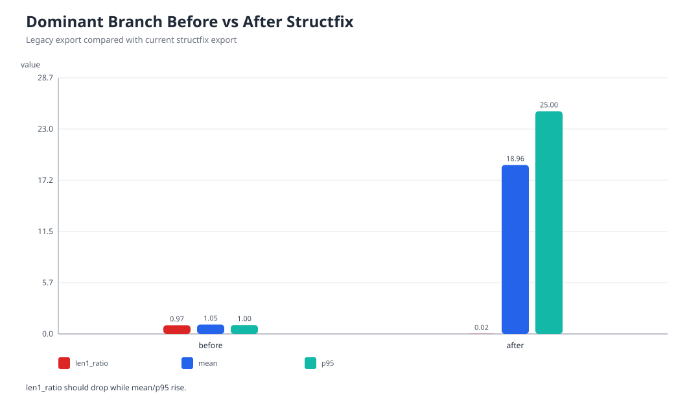
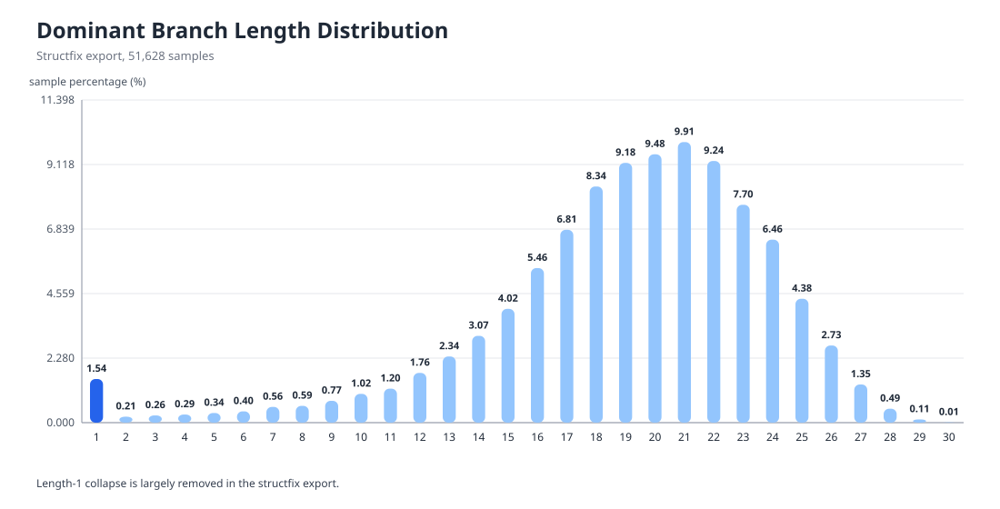
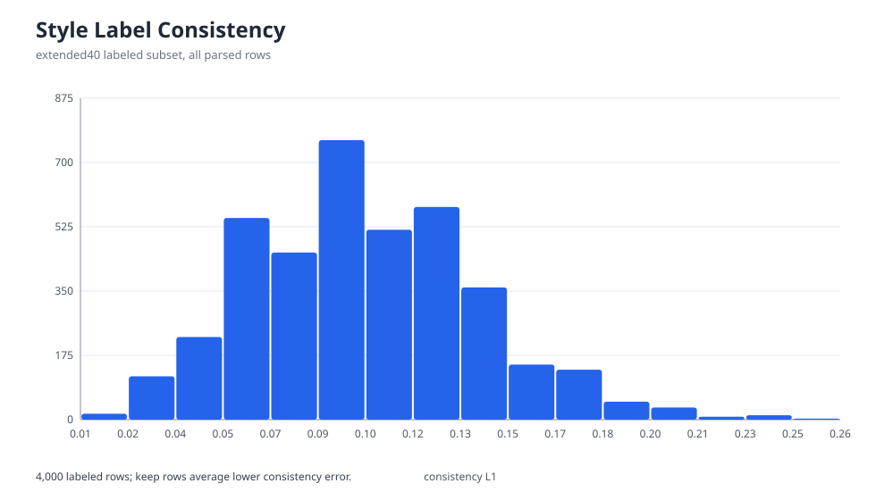
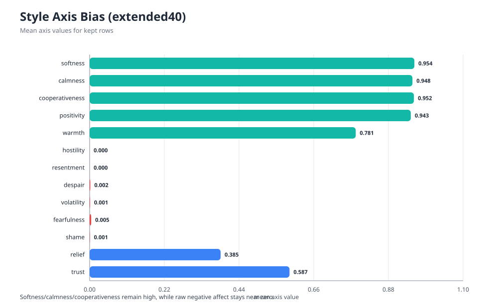
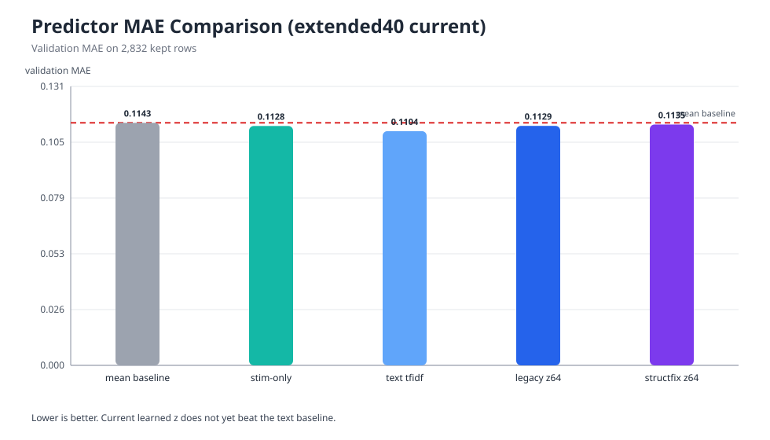

# EmoNet: Structfix Refresh Draft v1

> 생성일: 2026-04-07  
> 기준 산출물: `extended40` 4,000-row labeling, `structfix` full export, `structfix_reuse` learned z artifacts  
> 주의: 이 문서는 [PAPER_FRESH_DRAFT_ko.md](./PAPER_FRESH_DRAFT_ko.md)를 덮어쓰지 않고, current evidence만 다시 반영한 refresh draft이다.

## 1. 요약
이번 refresh에서 가장 큰 변화는 branch collapse가 구조 수정으로 사실상 해소되었다는 점이다. 이전 full export에서는 dominant branch 길이 1 비율이 97.34%였고 평균 길이는 1.0539였다. 반면 current `structfix` export에서는 길이 1 비율이 1.54%, 평균 길이는 18.9649, `p95`는 25로 증가하였다. 즉 EmoNet의 핵심 병목 중 하나였던 "branch가 거의 항상 1-step에서 끝난다"는 문제는 current cycle에서 더 이상 주된 실패 원인으로 보기 어렵다.

그러나 모든 문제가 해결된 것은 아니다. `extended40` 라벨링의 keep rows 2,832개를 기준으로 보면 `softness`, `calmness`, `cooperativeness`, `positivity`는 여전히 0.94 이상으로 매우 높고, `hostility`, `resentment`, `despair`, `volatility`, `fearfulness`, `shame`은 거의 0에 가깝다. 또한 current predictor 비교에서는 `text tfidf ridge`가 가장 낮은 MAE를 기록했고, `structfix learned z64`는 mean baseline보다는 약간 낫지만 text baseline을 넘지 못했다. 즉 branch collapse는 해결되었지만, target style bias와 `z -> s` predictor 경쟁력은 아직 해결되지 않았다.

## 2. Current Snapshot

| 항목 | 값 |
| --- | --- |
| full `structfix` export rows | 51,628 |
| branch mean | 18.9649 |
| branch len=1 ratio | 0.0154 |
| branch p95 | 25 |
| branch max | 30 |
| labeled rows (`extended40`) | 4,000 |
| parsed ok rows | 3,971 |
| keep rows | 2,832 |
| consistency mean (`ok`) | 0.1022 |
| consistency mean (`keep`) | 0.0832 |
| learned z rows | 2,832 |

산출물 경로:
- `figures`: `outputs/paper/refresh_2026-04-07_structfix_v1/figures`
- `tables`: `outputs/paper/refresh_2026-04-07_structfix_v1/tables`

## 3. 갱신된 그림

### 3.1 Encoder benchmark

이 그림은 변경되지 않았다. 자극 인코더 단계의 best setting은 여전히 `char_tfidf + Ridge`이며, current 병목을 encoder 이전 단계로 해석할 근거는 약하다.

### 3.2 Branch before/after

이 비교는 current cycle에서 가장 중요한 결과다. 기존 export 대비 current `structfix`는 `len1_ratio`를 0.9734에서 0.0154로 낮췄고, 평균 길이는 1.0539에서 18.9649로 끌어올렸다. 따라서 branch collapse는 더 이상 "남아 있는 가설"이 아니라, 구조 수정으로 실제 완화된 현상으로 서술할 수 있다.

### 3.3 Current branch distribution

current full export 분포는 길이 20 근처에 질량이 모여 있으며, 길이 1은 전체의 1.54%만 차지한다. 다만 sample-level smoke에서는 여전히 `dominant_branch_len=1`이 나올 수 있으므로, 분포 개선과 개별 추론 안정성은 구분해서 해석해야 한다.

### 3.4 Style consistency histogram

current `extended40` labeling은 대규모에서도 consistency가 유지된다. 그러나 consistency가 높다는 사실은 target distribution의 타당성을 보장하지 않는다. 실제 병목은 self-consistency가 아니라, target style 자체가 특정 방향으로 편향되어 있다는 점이다.

### 3.5 Style axis bias

keep rows 평균을 보면 `softness=0.9537`, `calmness=0.9480`, `cooperativeness=0.9522`, `positivity=0.9431`로 매우 높다. 반대로 `hostility=0.0001`, `resentment=0.0001`, `despair=0.0020`, `volatility=0.0012`, `fearfulness=0.0046`, `shame=0.0008`은 거의 죽어 있다. 따라서 style bias 문제는 current cycle에서도 해결되지 않았다.

### 3.6 Current predictor comparison

current 2,832 keep rows 기준 predictor MAE는 다음과 같다.

| predictor | mean MAE | baseline 대비 gain |
| --- | ---: | ---: |
| mean baseline | 0.114318 | 0.000000 |
| stim-only ridge | 0.112829 | 0.001489 |
| text tfidf ridge | 0.110391 | 0.003926 |
| legacy z64 ridge | 0.112874 | 0.001444 |
| structfix learned z64 ridge | 0.113513 | 0.000805 |

current learned `z`는 mean baseline보다 약간 낫지만, 가장 좋은 predictor는 여전히 text tfidf baseline이다. 즉 branch collapse 해결이 곧바로 predictor superiority로 이어지지는 않았다.

## 4. 무엇이 해결되었는가

### 4.1 해결된 문제
1. dominant branch collapse가 구조 수정으로 크게 완화되었다.
2. full export 차원에서 branch history가 더 이상 trivial하지 않다.
3. branch 기반 중간표현을 학습 가능한 형태로 유지할 기반은 확보되었다.

### 4.2 아직 해결되지 않은 문제
1. style target distribution은 여전히 지나치게 부드럽고 협조적이다.
2. current learned `z`는 text baseline보다 좋은 predictor가 아니다.
3. sample-level generation stability는 아직 약하다. 최신 smoke에서도 응답이 `"지금 예민하고 피곤한 상태라면"`에서 끊긴 사례가 있었다.
4. current prompt 기준 baseline generation matrix는 아직 다시 채점되지 않았다. 따라서 end-to-end 품질 우위는 아직 입증되지 않았다.

## 5. 해석
이번 refresh는 연구 실패를 보여주는 문서가 아니다. 오히려 구조적 진단이 한 단계 진전되었음을 보여준다. 이전 초안에서는 branch collapse, style bias, predictor weakness가 동시에 얽혀 있어 어디서 문제가 생기는지 분리하기 어려웠다. current cycle에서는 branch collapse가 크게 줄어들었기 때문에, 이제 남은 핵심 병목을 `target style bias`와 `z -> s` 예측력 부족으로 더 좁혀서 논의할 수 있다.

따라서 현재 서술은 다음처럼 바꾸는 편이 정확하다.
- 이전: "EmoNet 전체가 아직 실패한 상태로 보인다."
- 현재: "EmoNet은 branch collapse를 구조적으로 완화하는 데 성공했지만, style supervision distribution과 predictor competitiveness는 여전히 개선이 필요하다."

## 6. 다음 단계
1. `extended40` target rebalancing을 적용한 새 labeling set을 만든다.
2. `hostility`, `resentment`, `despair`, `volatility`, `fearfulness`, `shame` 축을 살리는 axis-aware keep rule을 적용한다.
3. current prompt 기준 generation matrix를 다시 수집하고 scoring을 새로 돌린다.
4. predictor 비교는 `structfix learned z`와 `rebalanced target` 조합으로 다시 측정한다.

## 7. 부록: 새 버전 산출물
- summary JSON: `outputs/paper/refresh_2026-04-07_structfix_v1/tables/paper_refresh_summary.json`
- current predictor table CSV: `outputs/paper/refresh_2026-04-07_structfix_v1/tables/baseline_predictor_table_current.csv`
- current predictor table JSON: `outputs/paper/refresh_2026-04-07_structfix_v1/tables/baseline_predictor_table_current.json`

