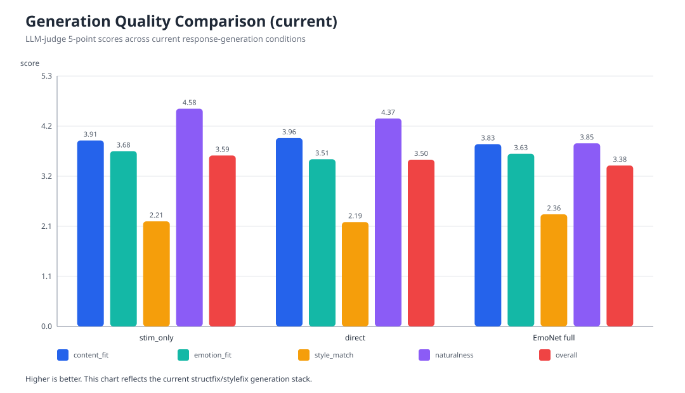

# EmoNet: 감정 동역학 기반 한국어 응답 생성 프레임워크

> 상태 메모 (2026-04-09): 이 문서는 현재 작업 디렉터리의 단일 canonical draft이다. 본문 수치와 그림은 `refresh_2026-04-09_calref_v1` 산출물을 기준으로 갱신했다. 최신 `v4` 구현에서는 raw trajectory를 GPT-5.4가 `emotion episode`로 해석하고, 그 episode를 다시 generation conditioning에 넣는 경로까지 연결했다.

## 초록
본 연구는 한국어 감정 응답 생성을 `자극 인코딩 -> 감정 동역학 -> 지배 branch/trajectory -> 잠재 감정 표현 z -> 스타일 표현 s -> LLM 표면화`로 분해하는 EmoNet 프레임워크를 제안한다. EmoNet의 목적은 단순히 응답 품질을 높이는 것에 그치지 않고, 감정 제어 실패가 어느 단계에서 발생하는지 추적 가능한 구조를 제공하는 데 있다. 최신 cycle에서는 branch dynamics를 실험적으로 보정한 calibrated reference config를 도입하여, full export 51,628개 기준 dominant branch 평균 길이를 1.0539에서 70.4684로 늘리고, 길이 1 비율을 97.34%에서 9.48%로 낮췄다. 또한 branch calibration 과정에서 `no_activity_ratio=0.05`, `len1_ratio=0.05`, `hit_max_ticks_ratio=0.25`, `mean_first_active_tick=2.40`, `mean_branch_len=79.78`을 만족하는 reference config를 실험적으로 도출했다. 이후 raw trajectory를 그대로 요약하는 것만으로는 감정 episode를 충분히 설명하지 못한다는 점을 확인했고, `trajectory -> GPT-5.4 episode interpretation` 경로를 추가했다. 이 해석기는 긍정적 고각성을 분노로 오독하던 heuristic readout을 교정하고, 자극 라벨이 아니라 `stimulus + appraisal + trajectory + action tendency` 전체를 감정 episode로 읽는다. 그러나 최신 end-to-end 평가에서는 `stim_only`가 `mean_total=3.5933`으로 가장 높았고, `emonet_full`은 `style_match=2.3559`에서는 상대적으로 우세하지만 `naturalness=3.8475`, `overall_quality=3.3814`에서 밀렸다. 또한 style target은 여전히 `softness`, `calmness`, `cooperativeness`, `positivity`에 강하게 치우쳐 있고, `hostility`, `resentment`, `despair` 같은 raw affect 축은 거의 활성화되지 않는다. 따라서 현재 EmoNet은 branch collapse를 상당 부분 해결했고 raw trajectory 해석력도 높였지만, style target bias, `z -> s` predictor 경쟁력, 그리고 최종 응답의 자연스러움 측면에서는 여전히 개선이 필요하다.

주요어: 감정 응답 생성, controllable generation, 스타일 제어, branch dynamics, 잠재표현, 한국어 LLM

## 1. 문제와 목표
대규모 언어모델 기반 감정 응답 시스템은 의미 보존과 문장 자연성은 빠르게 향상되었지만, 감정이 내부에서 어떻게 형성되고 어떤 경로를 거쳐 표면 스타일로 변환되는지는 여전히 설명하기 어렵다. 기존 방식은 감정 라벨, 속성 토큰, prompt attribute를 직접 주입하는 경우가 많아, 실패 원인을 내부 상태 수준에서 추적하기 어렵다.

EmoNet의 목표는 이 문제를 모듈적으로 분해하는 것이다.

1. 입력 텍스트를 4차원 affective stimulus로 변환한다.
2. stimulus가 graph-based 감정 동역학 내부에서 어떻게 확산, 억제, 유지되는지 branch 형태로 기록한다.
3. dominant branch를 잠재 감정 표현 `z`로 압축하고, 다시 스타일 벡터 `s`로 사상한다.
4. 최종 LLM은 감정 상태를 계산하는 주체가 아니라, EmoNet이 계산한 감정 상태와 스타일을 언어로 표면화하는 역할을 맡는다.

이 구조의 강점은 성능이 완전히 최고가 아니더라도, 실패가 encoder, dynamics, branch summary, `z -> s`, prompt surface 중 어디에서 발생하는지 더 정밀하게 진단할 수 있다는 점이다.

## 2. 현재 시스템 개요
현재 active pipeline은 다음 흐름을 따른다.

```math
x \rightarrow E_{aff}(x) \rightarrow v_{stim} \rightarrow \mathcal{N}_{cad} \rightarrow H_{traj} \rightarrow z \rightarrow s \rightarrow G_{prompt} \rightarrow LLM \rightarrow y
```

핵심 설계는 다음과 같다.

- `E_aff`: 입력 텍스트를 `dopamine`, `serotonin`, `norepinephrine`, `melatonin` 4축 stimulus로 투영한다.
- `\mathcal{N}_{cad}`: 256-node clustered neuro-affective dynamics core가 stimulus를 전개한다.
- `H_traj`: tick별 활성 노드와 firing edge를 기록한다.
- `dominant branch`: trajectory memory에서 상대적으로 지배적인 경로를 추출한다.
- `z`: dominant branch를 압축한 잠재 감정 표현이다.
- `s`: `z`로부터 회귀한 40차원 스타일 표현이다.
- `G_prompt`: `STYLE_TAGS + STYLE_SUMMARY` 중심의 condensed prompt surface를 구성한다.

이번 cycle의 중요한 변경은 calibrated reference config를 도입했다는 점이다. 이 config는 임의 초기값이 아니라, trace-level calibration 실험을 통해 도출한 reference setting이다.

## 3. 실험 상태 요약

| 항목 | 최신 값 |
| --- | ---: |
| full `z` export rows | 51,628 |
| branch mean | 70.4684 |
| branch len=1 ratio | 0.0948 |
| branch p90 / p95 / max | 126 / 126 / 126 |
| parsed style rows | 3,971 |
| current keep-valid rows (bias summary) | 1,717 |
| rebalanced supervised rows used for training | 1,800 |
| encoder head val MAE | 0.10273 |
| decoder val MAE | 0.117898 |
| generation matrix rows | 360 |
| scored generation rows | 357 |

현재 active 산출물은 다음 경로를 기준으로 한다.

- figures/tables: `outputs/paper/refresh_2026-04-09_calref_v1`
- calibrated config: `outputs/branch_calibration/reference_calibration_rdp_v1/calibrated_reference_config.json`
- learned artifacts:
  - `artifacts/dominant_branch_encoder_extended40_calref_v1.pt`
  - `artifacts/z_to_s_decoder_extended40_calref_v1.npz`

## 4. 주요 결과

### 4.1 Branch collapse는 크게 완화되었다
가장 중요한 변화는 dominant branch collapse가 구조적으로 완화되었다는 점이다.


- 이전 full export: 평균 길이 `1.0539`, `len1_ratio=0.9734`
- 현재 calibrated export: 평균 길이 `70.4684`, `len1_ratio=0.0948`

즉 branch는 더 이상 거의 항상 1-step에서 끝나지 않는다. 이 결과는 EmoNet의 branch-based 중간표현이 이제 최소한 non-trivial한 형태를 갖추었다는 뜻이다.

하지만 상단 tail은 여전히 ceiling에 붙는다.


`p90=126`, `p95=126`, `max=126`이므로 일부 샘플은 여전히 `max_ticks` 근처까지 간다. 따라서 branch collapse는 해결되었지만, upper-tail saturation은 아직 남아 있다.

### 4.2 Calibration으로 reference config의 근거를 만들었다
이번 cycle에서는 reference config를 임의값이 아니라 calibration 실험으로 도출했다. 결합 검증 결과는 다음과 같다.

- `no_activity_ratio = 0.05`
- `len1_ratio = 0.05`
- `hit_max_ticks_ratio = 0.25`
- `mean_first_active_tick = 2.40`
- `mean_branch_len = 79.78`
- `is_feasible = true`

이 결과는 현재 reference setting이 단순히 “좋아 보이는 숫자”가 아니라, 점화, branch depth, saturation, dead sample 비율을 동시에 고려한 실험 기반 선택이라는 점을 뒷받침한다.

### 4.3 Style target bias는 여전히 강하다
style labeling consistency는 유지되지만, target distribution은 여전히 과도하게 온건하다.


현재 keep-valid rows 평균을 보면:

- 높은 축:
  - `softness = 0.9276`
  - `calmness = 0.9132`
  - `cooperativeness = 0.9202`
  - `positivity = 0.9051`
- 매우 낮은 축:
  - `hostility = 0.0003`
  - `resentment = 0.0003`
  - `despair = 0.0044`
  - `volatility = 0.0022`
  - `fearfulness = 0.0100`
  - `shame = 0.0017`

즉 consistency는 확보되었지만 supervision target 자체가 지나치게 soft하고 safe하다. 현재 EmoNet의 생성 편향은 dynamics보다 target bias에서 더 강하게 유도될 가능성이 높다.

### 4.4 Predictor는 아직 text baseline을 넘지 못한다
`z -> s` 경로는 현재도 text baseline보다 약하다.


| predictor | mean MAE | baseline 대비 gain |
| --- | ---: | ---: |
| mean baseline | 0.117288 | 0.000000 |
| stim-only ridge | 0.116513 | 0.000775 |
| text tfidf ridge | 0.114628 | 0.002660 |
| legacy z64 ridge | 0.116846 | 0.000442 |
| structfix learned z64 ridge | 0.117328 | -0.000040 |

branch dynamics는 분명히 개선되었지만, 그 개선이 현재 learned `z`에서 predictor superiority로 이어지지는 않았다. 이 지점은 dynamics와 decoder/predictor 사이의 정보 손실을 의심하게 만든다.

### 4.5 End-to-end 생성에서는 `stim_only`가 아직 최고다
최신 generation matrix를 GPT-5.4 judge로 채점한 결과는 다음과 같다.



| condition | rows | content fit | emotional appropriateness | style match | naturalness | overall quality | mean total |
| --- | ---: | ---: | ---: | ---: | ---: | ---: | ---: |
| stim_only | 120 | 3.9083 | 3.6833 | 2.2083 | 4.5750 | 3.5917 | 3.5933 |
| direct | 119 | 3.9580 | 3.5126 | 2.1933 | 4.3697 | 3.5042 | 3.5076 |
| emonet_full | 118 | 3.8305 | 3.6271 | 2.3559 | 3.8475 | 3.3814 | 3.4085 |

해석은 분명하다.

- `emonet_full`은 `style_match`에서 가장 높다.
- 그러나 `naturalness`와 `overall_quality`에서 가장 낮다.
- 따라서 EmoNet conditioning은 style signal을 일부 반영하지만, 그 대가로 문장 자연스러움과 종합 품질을 깎고 있다.

## 5. 현재 단계의 해석
이번 cycle은 “EmoNet이 완전히 해결되었다”는 결과가 아니다. 더 정확한 해석은 다음과 같다.

1. branch collapse는 해결 단계에 진입했다.
2. calibrated reference config는 실험적 근거를 갖춘 working reference로 볼 수 있다.
3. 그러나 시스템의 주병목은 이제 branch가 아니라 `style target bias`, `predictor competitiveness`, `generation naturalness`로 이동했다.

즉 현재 EmoNet의 강점은 branch dynamics를 해석 가능한 중간표현으로 끌어올렸다는 점이고, 약점은 그 중간표현이 아직 최종 품질 이득으로 안정적으로 번역되지 않는다는 점이다.

## 6. 남은 문제와 다음 단계
현재 남은 핵심 문제는 네 가지다.

1. style target bias를 더 강하게 줄여야 한다.
2. `z -> s` predictor가 text baseline을 넘도록 decoder 경로를 다시 설계해야 한다.
3. `emonet_full` prompt surface를 더 가볍게 만들어 naturalness 손실을 줄여야 한다.
4. branch upper-tail saturation을 더 낮춰야 한다.

실행 우선순위는 다음과 같다.

1. axis-aware rebalancing 강화
2. decoder/predictor 개선
3. prompt surface lightweighting
4. branch tail saturation 추가 완화

## 7. Active Canonical Artifacts
- Draft: `PAPER_DRAFT_ko.md`
- Active refresh bundle: `outputs/paper/refresh_2026-04-09_calref_v1`
- Active calibrated config:
  - `outputs/branch_calibration/reference_calibration_rdp_v1/calibrated_reference_config.json`
- Active learned artifacts:
  - `artifacts/dominant_branch_encoder_extended40_calref_v1.pt`
  - `artifacts/z_to_s_decoder_extended40_calref_v1.npz`
- Active generation matrix:
  - `outputs/experiments/paper_matrix_current_calref_v1.csv`
  - `outputs/experiments/paper_matrix_current_calref_v1_gpt54_scored.csv`

## 8. 결론
EmoNet의 current cycle은 branch collapse를 구조적으로 완화하고, reference config를 실험적으로 정당화하며, end-to-end 실패 원인을 더 좁은 범위로 분해하는 데 성공했다. 반면 최종 생성 품질에서는 아직 `stim_only`를 넘지 못했고, style target은 지나치게 온건하며, predictor는 text baseline보다 강하지 않다. 따라서 현재 단계의 가장 정확한 평가는 “구조적 진단은 성공했고, 이제 남은 병목은 style target과 end-to-end translation quality에 집중되어 있다”이다.
