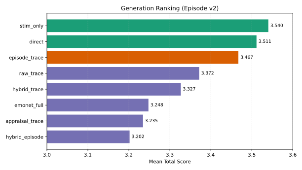
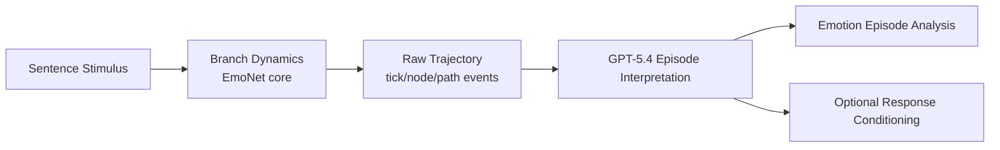
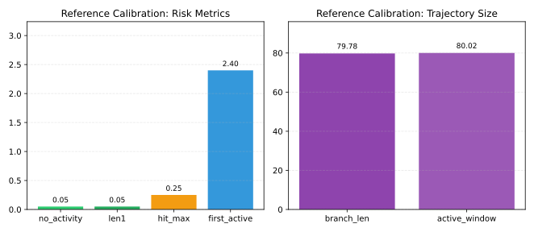
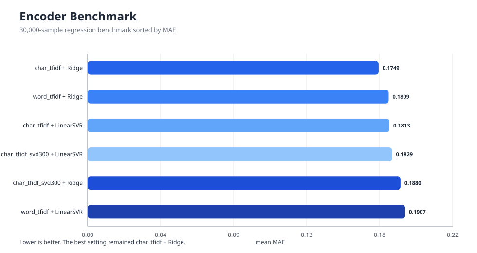
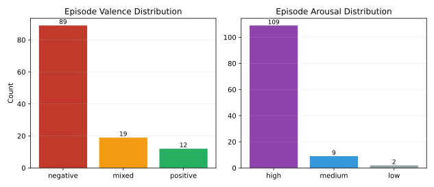
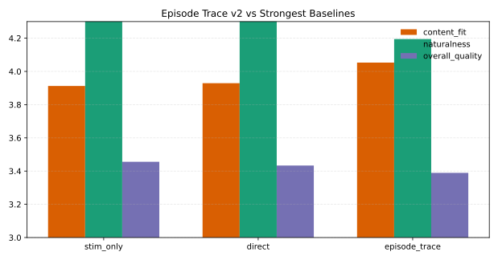

# EmoNet v4 Research Summary (2026-04-10)

이 문서는 `v4` 기준 현재 연구 상태를 한 번에 볼 수 있도록 정리한 canonical summary다.  
paper 작업의 현재 중심 문서는 [PAPER.md](/C:/Users/esl01/OneDrive/문서/GitHub/EmoNet_working/v4/paper/PAPER.md)이고, 상세 초안은 [PAPER_DRAFT_ko.md](/C:/Users/esl01/OneDrive/문서/GitHub/EmoNet_working/v4/PAPER_DRAFT_ko.md), 파라미터 변경 원칙은 [PAPER_METRICS_AND_PARAMETER_RATIONALE_2026-04-10.md](/C:/Users/esl01/OneDrive/문서/GitHub/EmoNet_working/v4/PAPER_METRICS_AND_PARAMETER_RATIONALE_2026-04-10.md)를 본다.

## 1. 연구 질문

이 연구의 중심 질문은 두 가지다.

1. 문장을 들었을 때 EmoNet 내부 branch dynamics가 실제로 서로 다른 affect trajectory를 형성하는가
2. 그 raw trajectory를 읽으면 stimulus label이 아니라 emotion episode를 복원할 수 있는가

현재 시점의 짧은 답은 다음과 같다.

- `branch collapse`는 구조적으로 해결되었다.
- raw trajectory는 heuristic top-emotion보다 훨씬 풍부한 internal affect episode를 담고 있다.
- `raw trajectory -> GPT-5.4 episode interpretation`은 semantic richness 면에서 유의미하게 성공했다.
- 그러나 이 내부 affect quality가 최종 generation superiority로 완전히 이어지지는 않았다.

### 1.1 Snapshot Figures

## 2. 현재 파이프라인

현재 active code path:

- core: [core.py](/C:/Users/esl01/OneDrive/문서/GitHub/EmoNet_working/v4/emonet/core.py)
- trajectory batch: [analyze_emotion_trajectory_batch.py](/C:/Users/esl01/OneDrive/문서/GitHub/EmoNet_working/v4/scripts/analyze_emotion_trajectory_batch.py)
- trajectory interpreter: [interpret_emotion_trajectory.py](/C:/Users/esl01/OneDrive/문서/GitHub/EmoNet_working/v4/scripts/interpret_emotion_trajectory.py)
- generation matrix: [experiment_matrix.py](/C:/Users/esl01/OneDrive/문서/GitHub/EmoNet_working/v4/scripts/experiment_matrix.py)

## 3. Branch Recovery And Calibration

출처:

- [paper_refresh_summary.json](/C:/Users/esl01/OneDrive/문서/GitHub/EmoNet_working/v4/outputs/paper/refresh_2026-04-09_calref_v1/tables/paper_refresh_summary.json)
- [combined_validation.json](/C:/Users/esl01/OneDrive/문서/GitHub/EmoNet_working/v4/outputs/branch_calibration/reference_calibration_rdp_v1/combined_validation.json)
- [calibrated_reference_config.json](/C:/Users/esl01/OneDrive/문서/GitHub/EmoNet_working/v4/outputs/branch_calibration/reference_calibration_rdp_v1/calibrated_reference_config.json)

### 3.1 Branch Collapse Recovery

| Metric | Before | After |
| --- | ---: | ---: |
| Rows | 51,628 | 51,628 |
| Mean dominant branch length | 1.0539 | 70.4684 |
| `len1_ratio` | 0.9734 | 0.0948 |
| P50 | 1 | 69 |
| P75 | 1 | 117 |
| P90 | 1 | 126 |
| P95 | 1 | 126 |
| Max | 8 | 126 |

해석:

- `len1_ratio`가 `0.9734 -> 0.0948`로 내려가면서 branch collapse는 명확히 완화되었다.
- 다만 상단 tail은 아직 `126` 근처에 몰려 있어 upper-tail saturation은 남아 있다.

고유 branch length가 `123`개라 per-length 막대는 읽을 수 없어서, 아래 분포는 구간 binning(`1`, `2-10`, `11-20`, ..., `121-126`)으로 다시 그렸다.

### 3.2 Calibration-Backed Reference Config

| Metric | Value |
| --- | ---: |
| `is_feasible` | `true` |
| `no_activity_ratio` | 0.05 |
| `len1_ratio` | 0.05 |
| `hit_max_ticks_ratio` | 0.25 |
| `mean_first_active_tick` | 2.40 |
| `late_ignition_ratio_ge_15` | 0.00 |
| `mean_branch_len` | 79.78 |
| `mean_active_window_ticks` | 80.02 |
| `evidence_score` | 88.8412 |

채택된 calibrated reference config의 핵심값:

| Parameter Group | Current Value |
| --- | --- |
| Ignition | `k_threshold_base=0.70`, `k_remem_base=1.10`, `input_signal_clip=0.8`, `intrinsic_alignment_gain=0.28` |
| Persistence | `k_decay=0.91`, `memory_decay=0.97`, `memory_k_mix=0.35` |
| Fatigue / inhibition | `fatigue_gain=0.25`, `fatigue_threshold_gain=0.18`, `fatigue_k_leak=0.04`, `inhibitory_suppression_gain=0.24` |
| Convergence | `convergence_patience=3`, `activity_count_delta_eps=3.0`, `edge_count_delta_eps=12.0`, `activity_churn_eps=0.01` |

핵심 메시지:

- current reference config는 intuition으로 찍은 값이 아니라 calibration experiment로 선택되었다.
- 따라서 이후 파라미터 변경은 이 기준선보다 어떤 현상을 더 개선하는지 명시적으로 증명해야 한다.

## 4. Style Bias And Predictor Limits

출처:

- [paper_refresh_summary.json](/C:/Users/esl01/OneDrive/문서/GitHub/EmoNet_working/v4/outputs/paper/refresh_2026-04-09_calref_v1/tables/paper_refresh_summary.json)

### 4.1 Style Target Bias

| High axes | Mean | Low axes | Mean |
| --- | ---: | --- | ---: |
| softness | 0.9276 | hostility | 0.0003 |
| calmness | 0.9132 | resentment | 0.0003 |
| cooperativeness | 0.9202 | shame | 0.0017 |
| positivity | 0.9051 | volatility | 0.0022 |
| warmth | 0.7596 | despair | 0.0044 |

해석:

- supervision target 자체가 너무 safe/cooperative하다.
- 최종 응답이 순화되는 이유를 생성 모델 탓만으로 돌릴 수 없다.

### 4.2 Predictor Competitiveness

| Model | Decoder MAE Mean | Gain vs Mean Baseline |
| --- | ---: | ---: |
| Mean baseline | 0.117288 | 0.000000 |
| `stim_only` | 0.116513 | +0.000775 |
| `text_tfidf` | 0.114628 | +0.002660 |
| `legacy_z64` | 0.116846 | +0.000442 |
| `structfix_learned_z64` | 0.117328 | -0.000040 |

해석:

- branch dynamics recovery가 곧바로 `z -> s` predictor superiority를 보장하지는 않는다.
- 현 시점에서 learned `z`는 text baseline보다 강하지 않다.

## 5. Raw Trajectory To GPT-5.4 Episode Interpretation

출처:

- [trajectory_batch_matrix120_v1_gpt54](/C:/Users/esl01/OneDrive/문서/GitHub/EmoNet_working/v4/outputs/research/trajectory_batch_matrix120_v1_gpt54)
- [EPISODE_INTERPRETATION_REPORT.md](/C:/Users/esl01/OneDrive/문서/GitHub/EmoNet_working/v4/outputs/research/trajectory_batch_matrix120_v1_gpt54/EPISODE_INTERPRETATION_REPORT.md)

### 5.1 Quantitative Summary

| Metric | Value |
| --- | ---: |
| Interpreted samples | 120 |
| Mean confidence | 0.9293 |
| Negative valence | 89 |
| Mixed valence | 19 |
| Positive valence | 12 |
| High arousal | 109 |
| Medium arousal | 9 |
| Low arousal | 2 |

해석:

- heuristic top-emotion readout보다 episode-level reportability가 훨씬 올라갔다.
- 현재 corpus 분포는 negative/high-arousal 쪽으로 강하게 치우쳐 있다.

### 5.2 Representative Cases

| Sample | Episode Label | Action Tendency | Valence / Arousal | Confidence |
| --- | --- | --- | --- | ---: |
| `s_000555` | 공개적 배제에 대한 공세적 당혹-분노 | 항의/문제제기 충동은 있으나 실제 행동은 보류, 경계와 반추가 지속 | negative / high | 0.95 |
| `s_003491` | 소진 압박에 묶인 경계성 긴장 | 쓰러지듯 철수하기보다 예민하게 버티고 막는 방향 | negative / high | 0.94 |
| `s_000527` | 미점화된 승진 불안 예고 | 적극 대처·회피·방어 어느 쪽도 형성되지 않은 판단 유예 | mixed / low | 0.95 |
| `s_001756` | 안도 기반의 적극적 감사 | 고마움을 구체적 보답 행동으로 옮기려는 접근 | positive / medium | 0.94 |

핵심 메시지:

- internal affect는 단일 라벨보다 `stimulus -> appraisal -> trajectory -> action tendency -> episode` 구조로 읽는 편이 훨씬 설득력 있다.
- 특히 `s_000527`처럼 표면상 불안 문장인데 내부적으로는 미점화 상태인 경우를 분리해낼 수 있다는 점이 중요하다.

## 6. Generation Results Are Secondary But Still Informative

이 연구의 중심은 response generation이 아니라 internal affect analysis다.  
다만 episode interpretation이 실제 surface conditioning에도 어느 정도 기여하는지 보기 위해 generation experiment를 보조 증거로 유지한다.

출처:

- [paper_matrix_current_episode_v2_scored_summary.json](/C:/Users/esl01/OneDrive/문서/GitHub/EmoNet_working/v4/outputs/experiments/paper_matrix_current_episode_v2_scored_summary.json)

### 6.1 Current Ranking

| Condition | Mean Total | Content Fit | Emotional Appropriateness | Naturalness | Overall Quality |
| --- | ---: | ---: | ---: | ---: | ---: |
| `stim_only` | 3.5404 | 3.9123 | 3.6228 | 4.4561 | 3.4561 |
| `direct` | 3.5115 | 3.9292 | 3.5841 | 4.4159 | 3.4336 |
| `episode_trace` | 3.4673 | 4.0531 | 3.5664 | 4.1947 | 3.3894 |
| `raw_trace` | 3.3717 | 3.9558 | 3.5133 | 4.1770 | 3.2743 |
| `hybrid_trace` | 3.3268 | 3.6964 | 3.5000 | 3.9732 | 3.2679 |
| `emonet_full` | 3.2478 | 3.6814 | 3.3805 | 3.7345 | 3.1504 |
| `appraisal_trace` | 3.2345 | 3.8091 | 3.3364 | 3.8727 | 3.1818 |
| `hybrid_episode` | 3.2018 | 3.6937 | 3.4054 | 3.5045 | 3.0721 |

### 6.2 Episode v1 vs v2

| Variant | Mean Total |
| --- | ---: |
| `episode_trace v1` | 2.6239 |
| `episode_trace v2 (episode-lite)` | 3.4673 |

핵심 해석:

- `episode interpretation` 자체가 실패한 것이 아니라, 그것을 generation에 넘기는 방식이 문제였다.
- `episode-lite`로 바꾸자 `episode_trace`가 naive `emonet_full`을 넘었다.
- 그래도 현재 최고는 여전히 `stim_only`다.

## 7. Parameter Changes Must Always Be Evidence-Backed

상세 규칙은 [PAPER_METRICS_AND_PARAMETER_RATIONALE_2026-04-10.md](/C:/Users/esl01/OneDrive/문서/GitHub/EmoNet_working/v4/PAPER_METRICS_AND_PARAMETER_RATIONALE_2026-04-10.md)에 정리되어 있다.  
이 문서에서 유지할 요지는 아래 표다.

| Parameter Group | Current Values | What It Is Allowed To Change | Primary Metrics | Guardrail Metrics |
| --- | --- | --- | --- | --- |
| Ignition / selectivity | `k_threshold_base=0.70`, `k_remem_base=1.10`, `input_signal_clip=0.8`, `intrinsic_alignment_gain=0.28` | dead sample, no-activity, late ignition | `no_activity_ratio`, `len1_ratio`, `mean_first_active_tick` | `hit_max_ticks_ratio`, `mean_branch_len` |
| Persistence / saturation | `k_decay=0.91`, `memory_decay=0.97`, `memory_k_mix=0.35`, `fatigue_*`, `inhibitory_suppression_gain=0.24` | upper-tail saturation, over-persistence | `hit_max_ticks_ratio`, `p90/p95/max`, `saturation_ratio` | `mean_branch_len`, `no_activity_ratio` |
| Convergence / stopping | `convergence_patience=3`, `activity_count_delta_eps=3.0`, `edge_count_delta_eps=12.0`, `activity_churn_eps=0.01` | reasonable stopping | `termination_reason`, `mean_active_window_ticks`, `silent_tail_ticks` | branch collapse, `max_ticks` saturation rebound |
| Structural / extraction | `max_ticks=128`, `topk_branches=4`, `branch_end_window=6`, `branch_length_bonus=0.35` | extraction fidelity | branch distribution, `mean_path_coverage`, `len1_ratio` | interpretability loss, runaway length inflation |
| Generation / surface | `episode_trace`, `hybrid_episode`, prompt rules | surface naturalness, softening | `mean_total`, `naturalness`, `overall_quality` | instruction echo, retry/error rate |

규칙:

- 파라미터는 `좋아 보여서` 바꾸지 않는다.
- 변경 제안마다 반드시 `가설 -> primary metric -> guardrail -> 실험 규모 -> 채택 기준`을 먼저 적는다.

## 8. What Is Proven And What Is Not

### 현재 방어 가능한 주장

- branch collapse는 구조적으로 완화되었다.
- current reference config는 calibration experiment로 정당화되었다.
- raw trajectory는 heuristic top-emotion readout보다 richer한 affect episode를 담고 있다.
- `raw trajectory -> GPT-5.4 episode interpretation`은 internal affect reportability를 분명히 개선한다.
- `episode_trace v2`는 naive `emonet_full`보다 generation score가 높다.

### 아직 주장하면 안 되는 것

- EmoNet이 인간처럼 감정을 느낀다.
- trajectory interpreter가 ground-truth emotion을 정확히 복원한다.
- current `z -> s` path가 text baseline보다 우월하다.
- episode conditioning이 전체 generation에서 최고 성능이다.

## 9. Remaining Problems

1. style target 자체가 너무 safe/cooperative하다.
2. predictor가 text baseline을 넘지 못한다.
3. upper-tail saturation이 남아 있다.
4. positive arousal, anticipatory state, low-arousal negative state의 분화가 아직 약하다.
5. generation은 여전히 `stim_only`가 strongest baseline이다.

## 10. Next Experiments

1. `episode_trace`와 `stim_only`의 paired win-rate, per-sample delta, bootstrap CI 계산
2. paraphrase pair에서 trajectory episode consistency 측정
3. causal ablation 실험
4. `felt_state`와 `response_style` supervision 분리
5. positive / anticipatory / low-arousal condition을 따로 모은 mini benchmark 구축

## 11. One-Line Summary

현재 EmoNet v4의 가장 강한 연구 메시지는 이것이다.

> 문장 자극은 branch dynamics 안에서 collapse되지 않는 raw affect trajectory를 만들 수 있고, 그 trajectory는 GPT-5.4를 통해 stimulus label보다 richer한 emotion episode로 해석될 수 있다. 다만 이 내부 affect quality가 아직 predictor superiority와 final generation dominance로 완전히 이어지지는 않았다.
