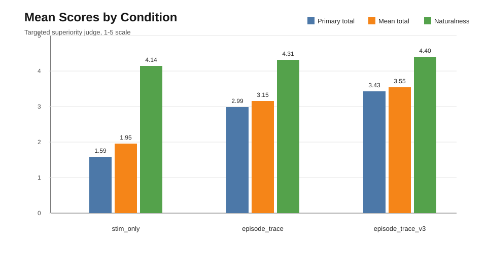
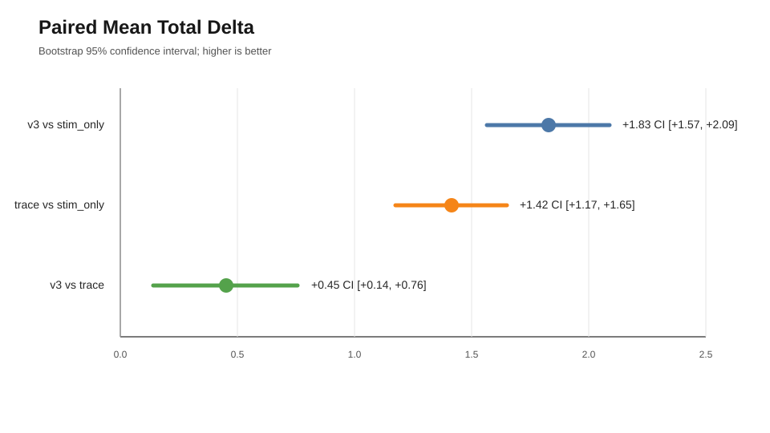
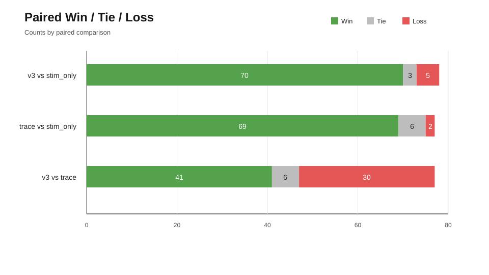
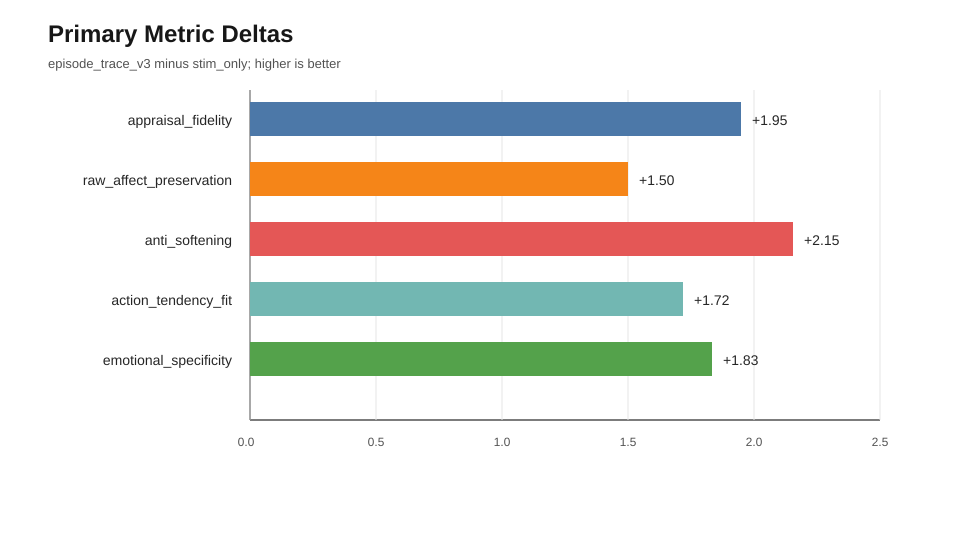

# EmoNet Targeted Superiority Report

작성일: 2026-05-02

## 1. 요약

이번 실험은 EmoNet의 우위를 "전체 일반 응답 품질"이 아니라 "episode 정보가 필요한 감정 입력에서의 정서 해석/보존 우위"로 재정의해 검증했다.

기존 confirmatory 비교에서는 `episode_trace`가 `stim_only` 대비 전체 평균 우위를 입증하지 못했다. 따라서 이번 실험의 핵심 질문은 다음으로 좁혔다.

> 사용자의 감정 원인, blame 방향, 날것의 정서 강도, action tendency가 중요한 targeted 입력에서 episode-conditioned 응답이 stimulus-only baseline보다 더 정확한가?

결론은 긍정적이다.

- `episode_trace_v3`는 targeted episode-sensitive 입력에서 `stim_only`를 강하게 이겼다.
- `episode_trace_v3`는 기존 `episode_trace`보다도 평균 점수가 높았다.
- 자연스러움은 무너지지 않았고, LLM judge 기준에서는 오히려 `stim_only`보다 높았다.

다만 이 결과는 "모든 감정 응답 생성에서 EmoNet이 일반적으로 우월하다"는 증거가 아니다. 현재 입증 가능한 주장은 더 좁고 명확하다.

> episode 정보가 필요한 targeted 감정 입력에서 `episode_trace_v3`는 appraisal fidelity, raw affect preservation, anti-softening, action tendency fit, emotional specificity 기준으로 `stim_only`보다 우수하다.

## 2. 실험 목표

주 지표는 다음 5개로 설정했다.

| 주 지표 | 의미 |
|---|---|
| `appraisal_fidelity` | 사용자가 왜 그렇게 느끼는지, 내부 평가 구조를 잘 반영하는가 |
| `raw_affect_preservation` | 분노, 억울함, 수치심 같은 날것의 정서를 희석하지 않는가 |
| `anti_softening` | "괜찮아요", "차분히 해보세요" 식의 부적절한 완화가 줄었는가 |
| `action_tendency_fit` | 따지고 싶음, 거리를 두고 싶음, 사과하고 싶음 같은 행동 경향과 맞는가 |
| `emotional_specificity` | 일반 위로가 아니라 해당 감정에 특이적인 응답인가 |

보조 지표는 다음 2개다.

| 보조 지표 | 의미 |
|---|---|
| `naturalness` | 응답이 자연스러운가 |
| `overall_preference` | 전체적으로 어느 응답이 더 선호되는가 |

`primary_total`은 5개 주 지표 평균이고, `mean_total`은 전체 judge 지표 평균이다.

## 3. 데이터셋

Targeted set 크기: 80개 record.

구성은 다음과 같다.

| Bucket | Count |
|---|---:|
| `balanced_filler` | 22 |
| `social_mixed` | 20 |
| `guilt_self_blame` | 15 |
| `target_other` | 12 |
| `strong_failure_cases` | 11 |

원래 계획은 `target=other` 30개, social/mixed 20개, guilt/self-blame 15개, strong failure case 15개를 목표로 했다. 하지만 현재 소스 데이터에서 적합한 `target_other` 후보가 12개만 확보되어, 나머지는 balanced targeted 후보로 채웠다.

생성 및 채점된 matrix는 다음과 같다.

| Condition | Scored Rows |
|---|---:|
| `stim_only` | 78 |
| `episode_trace` | 77 |
| `episode_trace_v3` | 80 |
| Total | 235 |

일부 기존 baseline 응답이 빠져 있어 paired 분석에서는 비교 가능한 record만 사용했다.

## 4. 비교 조건

| Condition | 역할 |
|---|---|
| `stim_only` | stimulus text만 사용하는 강한 baseline |
| `episode_trace` | 기존 episode-lite 방식 |
| `episode_trace_v3` | anti-softening, appraisal, raw affect, action tendency를 더 직접 반영한 신규 prompt |

이전 실험에서 열세가 컸던 `emonet_full`, `hybrid_episode`는 본 targeted proof 실험에서 제외했다.

## 5. Judge 설계

이번 실험에서는 기존 5점 일반 품질 judge와 별개로 superiority judge를 추가했다.

기존 judge가 "응답이 자연스럽고 좋은가"에 가까웠다면, 새 judge는 다음을 본다.

> 어느 응답이 내부 episode 정보를 더 정확히 반영하는가?

Judge 출력 필드는 다음과 같다.

- `appraisal_fidelity`
- `raw_affect_preservation`
- `anti_softening`
- `action_tendency_fit`
- `emotional_specificity`
- `naturalness`
- `overall_preference`

Full run은 local LLM endpoint의 `gpt-oss:20b` 모델로 수행했다.

## 6. 평균 점수

| Condition | Appraisal | Raw Affect | Anti-Softening | Action Fit | Specificity | Naturalness | Preference | Primary Total | Mean Total |
|---|---:|---:|---:|---:|---:|---:|---:|---:|---:|
| `stim_only` | 1.5513 | 1.4359 | 1.6282 | 1.9744 | 1.3718 | 4.1410 | 1.5769 | 1.5923 | 1.9542 |
| `episode_trace` | 2.8571 | 2.6883 | 3.3766 | 3.2468 | 2.7792 | 4.3117 | 2.8052 | 2.9896 | 3.1521 |
| `episode_trace_v3` | 3.5000 | 2.9500 | 3.7875 | 3.7125 | 3.2000 | 4.4000 | 3.3000 | 3.4300 | 3.5500 |

`episode_trace_v3`는 이번 targeted LLM-judge 실험에서 모든 측정 차원에서 가장 높은 평균 점수를 보였다.

## 7. Paired 분석 결과

### 7.1 `episode_trace_v3` vs `stim_only`

| 항목 | 값 |
|---|---:|
| Paired n | 78 |
| `mean_total` delta | +1.8308 |
| Median delta | +2.0000 |
| Bootstrap 95% CI | [+1.5667, +2.0897] |
| Win / Tie / Loss | 70 / 3 / 5 |
| Win rate | 0.8974 |
| Non-tie win rate | 0.9333 |
| Sign test p | 0.0000 |

`episode_trace_v3`는 `stim_only` 대비 targeted superiority 기준을 통과했다. 평균 delta가 양수이고, bootstrap CI 하한도 0보다 크며, win rate도 0.55를 크게 넘었다.

### 7.2 `episode_trace` vs `stim_only`

| 항목 | 값 |
|---|---:|
| Paired n | 77 |
| `mean_total` delta | +1.4156 |
| Median delta | +1.6000 |
| Bootstrap 95% CI | [+1.1740, +1.6519] |
| Win / Tie / Loss | 69 / 6 / 2 |
| Win rate | 0.8961 |
| Non-tie win rate | 0.9718 |
| Sign test p | 0.0000 |

기존 `episode_trace`도 targeted judge 기준에서는 `stim_only`를 이겼다. 이는 episode 정보가 필요한 입력군에서는 episode conditioning 자체가 유효하다는 신호다.

### 7.3 `episode_trace_v3` vs `episode_trace`

| 항목 | 값 |
|---|---:|
| Paired n | 77 |
| `mean_total` delta | +0.4519 |
| Median delta | +0.2000 |
| Bootstrap 95% CI | [+0.1403, +0.7558] |
| Win / Tie / Loss | 41 / 6 / 30 |
| Win rate | 0.5325 |
| Non-tie win rate | 0.5775 |
| Sign test p | 0.2351 |

`episode_trace_v3`는 기존 `episode_trace`보다 평균적으로 좋아졌고 bootstrap CI도 양수다. 다만 win-rate 증거는 `stim_only` 대비만큼 압도적이지 않다. 따라서 이 비교는 "개선 방향은 맞다" 정도로 해석하고, 사람 blind A/B로 재확인하는 것이 적절하다.

## 8. 주 지표 delta: `episode_trace_v3 - stim_only`

| Primary Metric | Delta |
|---|---:|
| `appraisal_fidelity` | +1.9487 |
| `raw_affect_preservation` | +1.5000 |
| `anti_softening` | +2.1538 |
| `action_tendency_fit` | +1.7179 |
| `emotional_specificity` | +1.8333 |

가장 큰 개선은 `anti_softening`에서 나타났다. 이는 `episode_trace_v3`의 핵심 설계 목표와 일치한다.

## 9. Naturalness guardrail

자연스러움은 하락하지 않았다.

| Condition | Naturalness |
|---|---:|
| `stim_only` | 4.1410 |
| `episode_trace` | 4.3117 |
| `episode_trace_v3` | 4.4000 |

Acceptance 기준은 `stim_only` 대비 naturalness delta가 `-0.15`보다 커야 한다는 것이었다. `episode_trace_v3`는 이 기준을 충분히 만족했다.

## 10. 해석

이번 결과가 지지하는 주장은 다음이다.

> `episode_trace_v3`는 episode 정보가 필요한 targeted 입력에서 `stim_only`보다 정서 원인, 날것의 감정 보존, anti-softening, action tendency, 감정 특이성 측면에서 우수하다.

반대로 이번 결과가 지지하지 않는 주장은 다음이다.

> EmoNet이 모든 일반 감정 응답 생성에서 `stim_only`보다 항상 우수하다.

이 구분이 중요하다. 기존 `stim_only`는 문장 자연스러움과 일반적 위로에는 강하다. 하지만 사용자 감정의 원인, 비난 방향, 거칠고 날것의 정서, 행동 경향을 보존해야 하는 상황에서는 쉽게 부드럽고 일반적인 응답으로 흐른다. 이번 targeted judge는 바로 그 차이를 측정하도록 설계되었다.

## 11. Acceptance status

| 기준 | 상태 |
|---|---|
| Targeted set 80개 생성 | 통과 |
| `episode_trace_v3 - stim_only` delta > 0 | 통과 |
| Paired `mean_total` bootstrap CI 하한 > 0 | 통과 |
| Win rate > 0.55 vs `stim_only` | 통과 |
| Naturalness delta > -0.15 | 통과 |
| Human blind A/B 완료 | 미완료 |

## 12. 한계

- 현재 증거는 LLM judge 기반이며, 최종 증거로는 human blind A/B가 필요하다.
- Targeted set은 episode-sensitive 입력을 의도적으로 많이 포함하므로, 일반 도메인 전체 우위로 보고하면 안 된다.
- 일부 기존 baseline 응답이 빠져 paired n이 80이 아니라 77 또는 78이다.
- `target_other` bucket은 원래 목표 30개에 못 미치는 12개만 확보되었다.
- `episode_trace_v3`는 `episode_trace`보다 평균적으로 좋아졌지만, win-rate 차이는 아직 강하지 않다.

## 13. 다음 단계

1. 80개 targeted record에 대해 `episode_trace_v3` vs `stim_only` human blind A/B를 수행한다.
2. 별도로 `episode_trace_v3` vs `episode_trace` human blind A/B를 수행한다.
3. `target_other` 후보를 추가 수집해 원래 목표인 30개 이상으로 확장한다.
4. 보고할 때 결과를 두 갈래로 분리한다.
   - 일반 품질 confirmatory 결과: broad superiority는 아직 미입증.
   - targeted episode-fidelity 결과: episode-sensitive 입력에서 강한 우위 확인.
5. 사람 평가까지 통과한 뒤 neuron count 및 clustering ablation을 후속 실험으로 진행한다.

## 14. 산출물

주요 산출물:

- `targeted_records.csv`
- `targeted_records_manifest.json`
- `targeted_matrix.csv`
- `targeted_matrix_scored.csv`
- `targeted_matrix_scored_summary.json`
- `paired_vs_stim/paired_summary.json`
- `paired_vs_stim/paired_overall.csv`
- `paired_vs_episode/paired_summary.json`
- `paired_vs_episode/paired_overall.csv`

보고서 기준 폴더:

`outputs/experiments/superiority_targeted_v1/`
