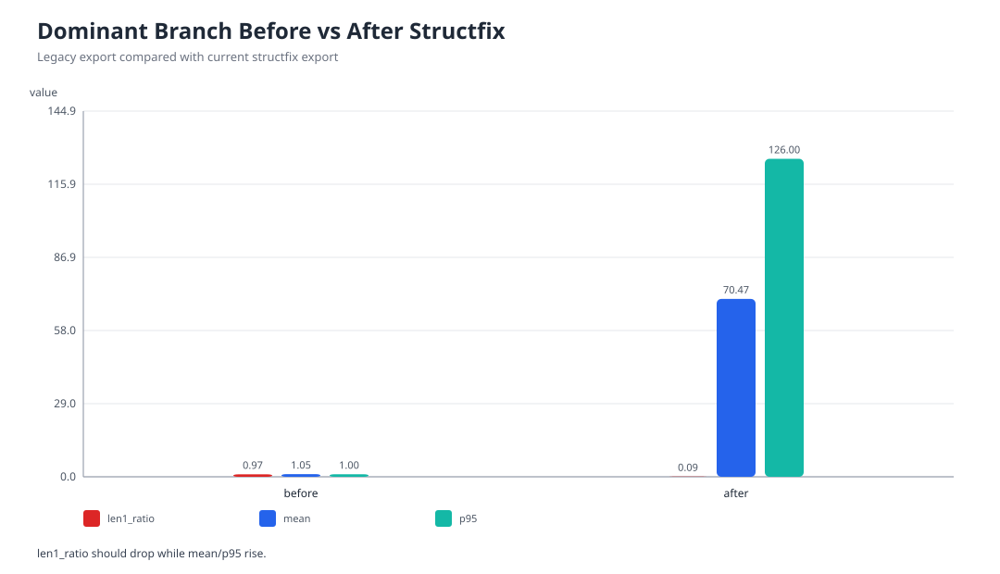
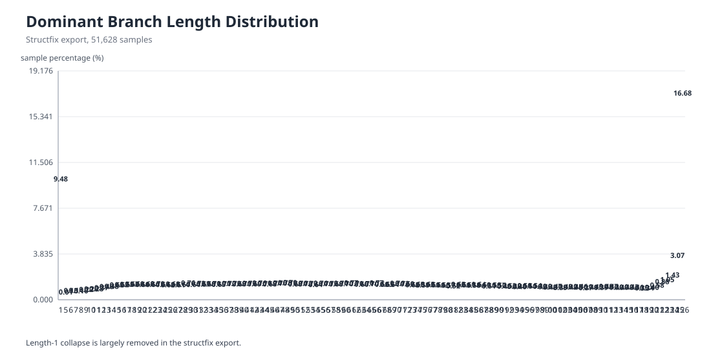
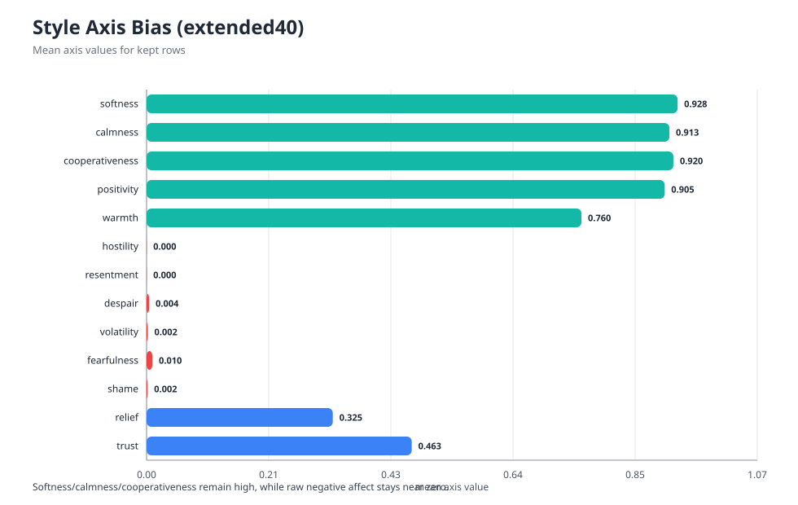
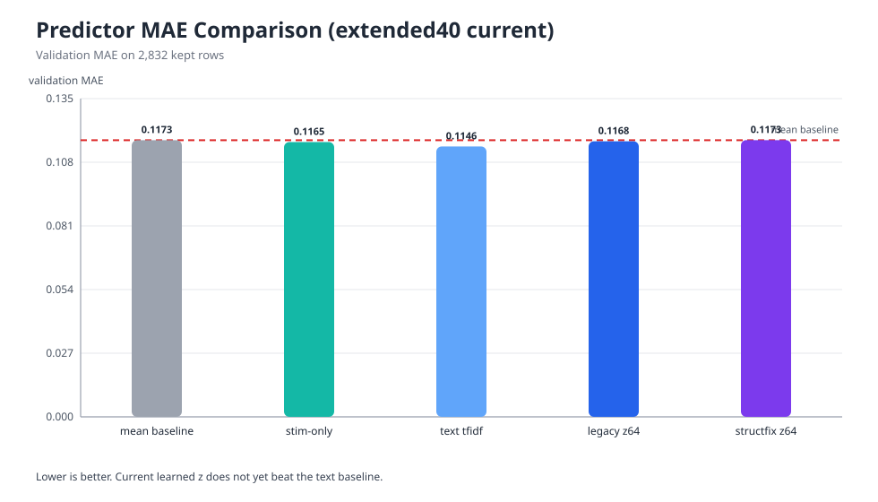

# EmoNet: 감정 동역학 기반 한국어 응답 생성 프레임워크

> 상태 메모 (2026-04-10): 이 문서는 `v4/paper` 작업 디렉터리의 Markdown 기준 원고다. 현재는 `branch recovery`, `trajectory interpretation`, `style bias`, `end-to-end generation gap`을 중심으로 논문 메시지를 고정하는 단계다.

## 초록

본 연구는 한국어 감정 응답 생성을 `자극 인코딩 -> 감정 동역학 -> branch/trajectory -> 잠재 감정 표현 z -> 스타일 표현 s -> LLM 표면화`로 분해하는 EmoNet 프레임워크를 제안한다. EmoNet의 핵심 목적은 단순히 응답 품질을 높이는 것이 아니라, 감정 제어 실패가 어느 단계에서 발생하는지 추적 가능한 중간표현을 만드는 데 있다. 최신 cycle에서는 calibrated reference configuration을 도입해 dominant branch 평균 길이를 1.0539에서 70.4684로 늘리고 길이 1 비율을 0.9734에서 0.0948로 낮췄다. 또한 heuristic emotion readout 대신 `raw trajectory -> GPT-5.4 episode interpretation` 경로를 추가해 trajectory 수준 affect episode를 더 풍부하게 읽을 수 있게 했다. 그러나 최신 end-to-end 평가에서는 `stim_only`가 mean total 3.5404로 가장 높고, `episode_trace`는 3.4673, `emonet_full`은 3.2478에 머문다. predictor 비교에서도 learned `z -> s` 경로는 text baseline을 넘지 못한다. 따라서 현재 EmoNet의 가장 강한 기여는 최종 성능 우위 자체보다, branch collapse 완화와 trajectory interpretation을 통해 감정 처리의 내부 병목을 더 명확하게 측정 가능하게 만들었다는 데 있다.

## 1. 문제와 포지셔닝

대규모 언어모델 기반 감정 응답 시스템은 문장 자연성과 의미 보존은 빠르게 좋아졌지만, 감정이 내부에서 어떻게 형성되고 어떤 경로를 거쳐 최종 말투로 번역되는지는 여전히 관찰하기 어렵다. 기존 방식은 감정 라벨, 속성 토큰, prompt attribute를 직접 주입하는 경우가 많아서 실패가 입력 인코더, 내부 동역학, 잠재표현, 스타일 회귀, 혹은 최종 surface realization 중 어디에서 발생했는지 분해해 보기 어렵다.

EmoNet은 이 문제를 단계별 파이프라인으로 재구성한다. 입력은 4차원 affective stimulus로 인코딩되고, clustered neuro-affective dynamics core가 이를 시간축으로 전개하며, dominant branch와 trajectory 요약이 잠재표현 `z`와 스타일 표현 `s`를 거쳐 최종 LLM 응답으로 이어진다.

현재 이 논문은 "최고 점수 모델" 논문보다는 다음 성격에 더 가깝다.

- 감정 생성 파이프라인을 단계별로 분해하고 진단 가능하게 만든 시스템 논문
- branch dynamics calibration과 trajectory interpretation을 중심에 둔 분석 논문
- 내부 품질 향상과 최종 generation gap을 함께 보여주는 honest paper

## 2. 시스템 개요

현재 active pipeline은 다음과 같이 요약된다.

```text
x -> E_aff(x) -> v_stim -> N_cad -> H_traj -> z -> s -> G_prompt -> LLM -> y
```

핵심 구성은 다음과 같다.

- `E_aff`: 입력 텍스트를 dopamine, serotonin, norepinephrine, melatonin 4축 stimulus로 투영한다.
- `N_cad`: 256-node clustered neuro-affective dynamics core가 stimulus를 시간축으로 전개한다.
- `H_traj`: tick별 활성 노드와 firing edge를 저장하는 trajectory memory다.
- `dominant branch`: trajectory에서 상대적으로 지배적인 경로를 추출한 intermediate representation이다.
- `z`: dominant branch를 압축한 잠재 감정 표현이다.
- `s`: `z`에서 회귀한 40차원 스타일 표현이다.
- `G_prompt`: 최종 LLM 표면화를 위한 conditioning layer다.

최근 active line의 중요한 변경은 heuristic top-emotion readout 대신 `raw trajectory -> GPT-5.4 episode interpretation` 경로를 추가했다는 점이다. 이 경로는 stimulus label 하나를 복원하는 접근보다, stimulus, appraisal, persistence, action tendency를 함께 읽어 `emotion episode`를 설명하는 쪽에 가깝다.

## 3. 현재 실험 상태 요약

### 3.1 Snapshot Table

| 항목 | 최신 값 |
| --- | ---: |
| full `z` export rows | 51,628 |
| branch mean | 70.4684 |
| branch len=1 ratio | 0.0948 |
| branch p90 / p95 / max | 126 / 126 / 126 |
| parsed style rows | 3,971 |
| keep-valid rows | 1,717 |
| rebalanced supervised rows | 1,800 |
| encoder head val MAE | 0.10273 |
| decoder val MAE | 0.117898 |

### 3.2 Source of Truth

현재 숫자는 아래 두 source를 기준으로 잡는다.

- branch, predictor, style bias: `outputs/paper/refresh_2026-04-09_calref_v1/tables/paper_refresh_summary.json`
- latest generation comparison: `outputs/experiments/paper_matrix_current_episode_v2_scored_summary.json`

중요한 점은 generation 결과가 refresh bundle 안의 baseline-only 표와 다르다는 것이다. 이 문서는 최신 `episode_v2` summary를 우선 기준으로 사용한다.

## 4. 주요 결과

### 4.1 Branch collapse recovery

가장 강하게 주장할 수 있는 결과는 dominant branch collapse가 구조적으로 완화되었다는 점이다.

| setting | rows | mean | len1 ratio | p50 | p90 | max |
| --- | ---: | ---: | ---: | ---: | ---: | ---: |
| before structfix | 51,628 | 1.0539 | 0.9734 | 1 | 1 | 8 |
| after structfix | 51,628 | 70.4684 | 0.0948 | 69 | 126 | 126 |





해석은 분명하다.

- branch는 더 이상 거의 항상 1-step에서 끝나지 않는다.
- branch-based intermediate representation은 이제 non-trivial한 구조를 가진다.
- 다만 upper-tail saturation은 아직 남아 있다. `p90 = p95 = max = 126`이다.

### 4.2 Calibration-backed reference configuration

현재 reference configuration은 임의값이 아니라 calibration experiment로 선택되었다.

| metric | value |
| --- | ---: |
| `is_feasible` | true |
| `no_activity_ratio` | 0.05 |
| `len1_ratio` | 0.05 |
| `hit_max_ticks_ratio` | 0.25 |
| `mean_first_active_tick` | 2.40 |
| `mean_branch_len` | 79.78 |
| `mean_active_window_ticks` | 80.02 |
| `evidence_score` | 88.8412 |

이 결과는 현재 reference setting이 단순히 "좋아 보이는 숫자"가 아니라, 점화 실패, branch collapse, 과도한 persistence 사이의 균형을 실험적으로 고른 설정이라는 점을 뒷받침한다.

### 4.3 Style target bias

현재 style supervision은 consistency는 유지하지만 분포 자체가 지나치게 safe하고 cooperative하다.

| high axes | mean | low axes | mean |
| --- | ---: | --- | ---: |
| softness | 0.9276 | hostility | 0.0003 |
| calmness | 0.9132 | resentment | 0.0003 |
| cooperativeness | 0.9202 | shame | 0.0017 |
| positivity | 0.9051 | volatility | 0.0022 |
| warmth | 0.7596 | despair | 0.0044 |




이 지점은 매우 중요하다. 내부 affect signal이 좋아져도 supervision target 자체가 다시 최종 표면을 순화시킬 수 있기 때문이다. 현재 EmoNet의 generation 편향은 dynamics 자체보다 style target bias에서 더 강하게 유도될 가능성이 높다.

### 4.4 Predictor competitiveness

`z -> s` predictor는 아직 text baseline을 넘지 못한다.

| predictor | mean MAE | gain vs baseline |
| --- | ---: | ---: |
| mean baseline | 0.117288 | 0.000000 |
| stim-only ridge | 0.116513 | 0.000775 |
| text tfidf ridge | 0.114628 | 0.002660 |
| legacy z64 ridge | 0.116846 | 0.000442 |
| structfix learned z64 ridge | 0.117328 | -0.000040 |



따라서 현재 learned latent가 predictor superiority를 확보했다고 쓰면 안 된다. branch dynamics recovery는 분명 존재하지만, 그 정보가 현재 latent compression과 style decoder를 거치면서 충분히 살아남지 못하고 있을 가능성이 높다.

### 4.5 End-to-end generation comparison

최신 `episode_v2` summary 기준 generation 결과는 아래와 같다.

| condition | rows | content fit | emotional appropriateness | style match | naturalness | overall quality | mean total |
| --- | ---: | ---: | ---: | ---: | ---: | ---: | ---: |
| `stim_only` | 114 | 3.9123 | 3.6228 | 2.2544 | 4.4561 | 3.4561 | 3.5404 |
| `direct` | 113 | 3.9292 | 3.5841 | 2.1947 | 4.4159 | 3.4336 | 3.5115 |
| `episode_trace` | 113 | 4.0531 | 3.5664 | 2.1327 | 4.1947 | 3.3894 | 3.4673 |
| `raw_trace` | 113 | 3.9558 | 3.5133 | 1.9381 | 4.1770 | 3.2743 | 3.3717 |
| `hybrid_trace` | 112 | 3.6964 | 3.5000 | 2.1964 | 3.9732 | 3.2679 | 3.3268 |
| `emonet_full` | 113 | 3.6814 | 3.3805 | 2.2920 | 3.7345 | 3.1504 | 3.2478 |
| `appraisal_trace` | 110 | 3.8091 | 3.3364 | 1.9727 | 3.8727 | 3.1818 | 3.2345 |
| `hybrid_episode` | 111 | 3.6937 | 3.4054 | 2.3333 | 3.5045 | 3.0721 | 3.2018 |

이 결과에서 읽어야 할 핵심은 세 줄이다.

- `episode_trace`는 `emonet_full`보다 높다. `3.4673 > 3.2478`
- `raw_trace`도 naive `emonet_full`보다 높다. `3.3717 > 3.2478`
- 그러나 최고 성능은 여전히 `stim_only`다. `3.5404`

즉 raw trajectory나 episode-conditioned path는 분명 naive `emonet_full`보다 더 유의미한 정보를 전달하고 있지만, 아직 최종 generation superiority를 확보하지는 못했다.

### 4.6 Trajectory interpretation quality

trajectory interpretation은 현재 다음처럼 위치 지어야 한다.

- heuristic top-emotion readout보다 더 풍부한 episode-level 설명을 제공한다.
- positive arousal, suspended anticipation, weak ignition 사례를 더 설득력 있게 기술한다.
- 하지만 아직 `ground-truth emotion recovery`라고 쓰면 안 된다.

이 해석기는 현재 단계에서 "정답 감정 분류기"가 아니라 "trajectory의 semantic reportability를 높이는 해석기"로 위치시키는 것이 안전하다.

## 5. 지금 논문이 주장해야 하는 것과 말아야 하는 것

### 5.1 주장해야 하는 것

1. branch collapse는 실질적으로 완화되었다.
2. reference configuration은 calibration 실험으로 정당화된다.
3. raw trajectory는 heuristic emotion label보다 더 풍부한 affect episode를 담는다.
4. internal trace quality improvement와 final generation improvement 사이에는 아직 분명한 간극이 있다.

### 5.2 지금 주장하면 안 되는 것

1. EmoNet이 인간처럼 감정을 느낀다.
2. episode interpreter가 ground-truth emotion을 정확히 복원한다.
3. current learned latent가 text baseline보다 우월하다.
4. episode conditioning이 전체 generation에서 최고다.
5. EmoNet이 end-to-end 성능까지 포함해 baseline을 전반적으로 이겼다.

## 6. 논문 서사 제안

현재 가장 방어 가능한 한 줄 메시지는 아래다.

> EmoNet은 branch collapse를 실질적으로 완화하고 raw trajectory를 더 풍부한 affect episode로 해석할 수 있게 만들었지만, 그 내부 품질이 아직 최종 generation superiority로 완전히 번역되지는 않는다.

이 메시지를 기준으로 본문은 아래 순서로 쓰는 것이 가장 안정적이다.

1. 기존 감정 생성은 내부 실패를 분해해서 보기 어렵다.
2. EmoNet은 감정 생성 파이프라인을 단계별로 분해한다.
3. calibration과 structfix로 branch collapse를 줄였다.
4. raw trajectory를 episode interpretation으로 읽는 경로를 만들었다.
5. 하지만 최종 generation에서는 아직 `stim_only`를 넘지 못한다.
6. 그 원인은 style bias, surface softening, `episode -> response` translation bottleneck이다.

## 7. 남은 과제

### 7.1 필수

1. `episode_trace`와 `stim_only` 비교를 bootstrap CI 또는 paired win-rate로 보강
2. qualitative case table 4~6개 고정
3. generation 그림도 최신 `episode_v2` 기준으로 다시 생성
4. 초록과 결론의 숫자 source를 하나로 통일

### 7.2 후속

1. episode interpretation paraphrase consistency
2. causal ablation metric
3. felt-state와 response-style supervision 분리
4. `legacy_cli.py` 분해

## 8. 오늘 기준 정리

현재 상태에서 논문 작성은 이미 시작해도 된다. 미해결 과제가 남아 있더라도, 지금 확보된 메시지는 충분히 선명하다.

- 구조적 회복: 이미 강하다.
- 내부 해석 가능성: 이미 논문화 가능하다.
- end-to-end 우위: 아직 부족하다.

따라서 지금 원고는 "모든 문제가 풀린 뒤 쓰는 문서"가 아니라, "무엇이 풀렸고 무엇이 아직 병목인지 정직하게 기록하는 문서"로 가는 편이 맞다.
